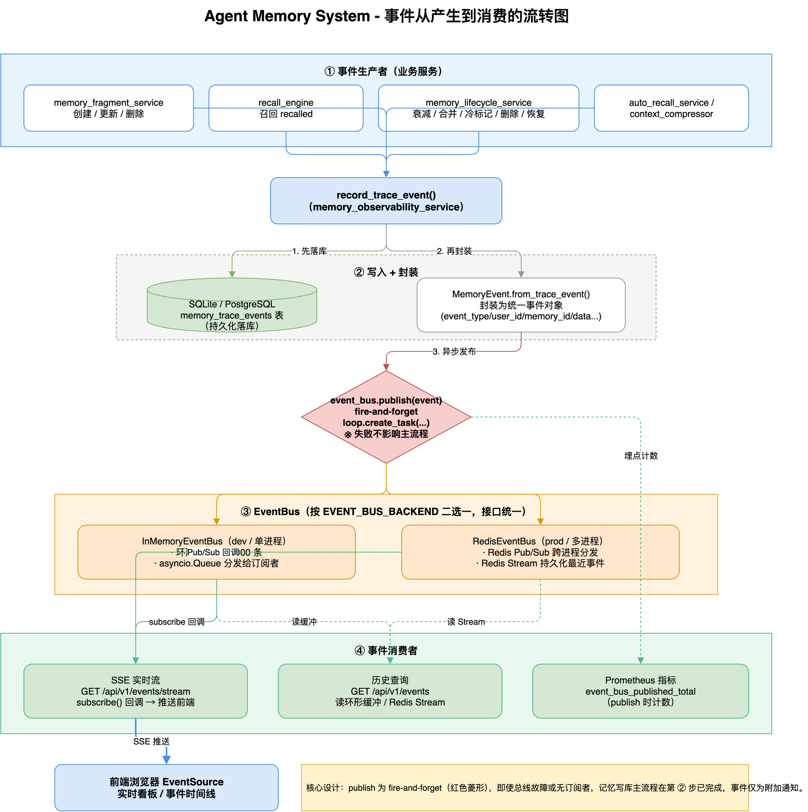
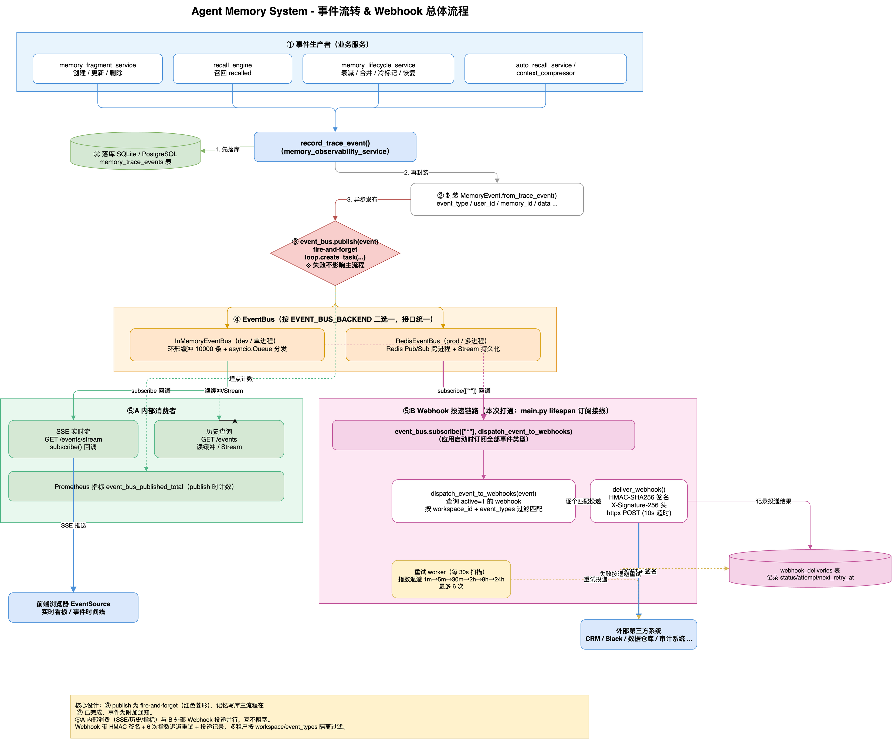

# Agent Memory System - 系统文档

## 📋 项目概述

Agent Memory System 是一个为 AI Agent 提供的完整记忆管理系统，支持：
- 🧠 **记忆变量**：轻量级 KV 存储（如 `user_name: "鑫海"`）
- 📊 **记忆表**：动态 Schema 结构化数据存储
- 📝 **记忆片段**：带 TTL 和向量嵌入的语义化记忆
- 🔍 **自动记忆召回**：基于语义相似性的智能记忆检索
- 📚 **长期记忆管理**：版本控制、自我改进、审计日志

---

## 🚀 快速开始

### Docker Compose（推荐）

```bash
# 开发环境（SQLite + FakeRedis）
docker-compose up -d

# 生产环境（PostgreSQL + Redis + ChromaDB）
docker-compose -f docker-compose.prod.yml up -d
```

### 手动启动

```bash
# 后端
cd backend
pip install -r requirements.txt
uvicorn app.main:app --reload --host 0.0.0.0 --port 8000

# 前端
cd frontend
npm install && npm run dev
```

### Kubernetes

```bash
kubectl apply -f k8s/deployment.yaml
```

---

## 📡 API 文档

启动服务后访问 `http://localhost:8000/docs` 查看 Swagger 文档。

### 认证 API
| 方法 | 路径 | 说明 |
|------|------|------|
| POST | `/api/v1/auth/register` | 用户注册 |
| POST | `/api/v1/auth/login` | 用户登录 |
| GET | `/api/v1/auth/me` | 获取当前用户信息 |

### 记忆变量 API
| 方法 | 路径 | 说明 |
|------|------|------|
| POST | `/api/v1/memory/variables` | 设置变量 |
| GET | `/api/v1/memory/variables` | 列出所有变量 |
| GET | `/api/v1/memory/variables/{key}` | 获取变量 |
| DELETE | `/api/v1/memory/variables/{key}` | 删除变量 |
| POST | `/api/v1/memory/extract` | 从文本抽取变量 |
| POST | `/api/v1/memory/render` | 渲染变量模板 |

### 记忆表 API
| 方法 | 路径 | 说明 |
|------|------|------|
| POST | `/api/v1/memory/tables/` | 创建表 |
| GET | `/api/v1/memory/tables/` | 列出所有表 |
| POST | `/api/v1/memory/tables/{name}/records` | 添加记录 |
| GET | `/api/v1/memory/tables/{name}/records` | 查询记录 |
| PUT | `/api/v1/memory/tables/{name}/records` | 更新记录 |
| DELETE | `/api/v1/memory/tables/{name}` | 删除表 |
| POST | `/api/v1/memory/tables/nl-query` | 自然语言查询 |

### 记忆片段 API
| 方法 | 路径 | 说明 |
|------|------|------|
| POST | `/api/v1/memory/fragments/` | 创建片段 |
| GET | `/api/v1/memory/fragments/` | 列出片段 |
| GET | `/api/v1/memory/fragments/{id}` | 获取片段 |
| PUT | `/api/v1/memory/fragments/{id}` | 更新片段 |
| DELETE | `/api/v1/memory/fragments/{id}` | 删除片段 |
| POST | `/api/v1/memory/fragments/search` | 语义搜索 |

### 自动召回 API
| 方法 | 路径 | 说明 |
|------|------|------|
| POST | `/api/v1/memory/recall/` | 自动召回 |
| GET | `/api/v1/memory/recall/config` | 获取配置 |
| PUT | `/api/v1/memory/recall/config` | 更新配置 |
| GET | `/api/v1/memory/recall/stats` | 召回统计 |

### 长期记忆管理 API
| 方法 | 路径 | 说明 |
|------|------|------|
| GET | `/api/v1/memory/long-term/memories` | 列出所有记忆 |
| POST | `/api/v1/memory/long-term/versions` | 记录版本 |
| GET | `/api/v1/memory/long-term/audit-log` | 审计日志 |
| POST | `/api/v1/memory/long-term/feedback` | 提交反馈 |
| POST | `/api/v1/memory/long-term/adjust-weight` | 调整权重 |

---

## 🛠️ 系统架构

```
┌─────────────────────────────────────────────────────────┐
│                     Frontend (React + TypeScript)        │
│                    http://localhost:3000                  │
└──────────────────────────┬──────────────────────────────┘
                           │ REST API
┌──────────────────────────┴──────────────────────────────┐
│                   Backend (FastAPI)                      │
│  ┌───────────┬───────────┬───────────┬──────────────┐   │
│  │ Variables │  Tables   │ Fragments │ Auto Recall  │   │
│  ├───────────┼───────────┼───────────┼──────────────┤   │
│  │Long-Term  │ LLM       │  Plugin   │  Security    │   │
│  │  Memory   │ Backend   │  System   │  Hardening   │   │
│  └───────────┴───────────┴───────────┴──────────────┘   │
└──────────┬────────────────┬───────────────┬─────────────┘
           │                │               │
    ┌──────▼──────┐  ┌──────▼──────┐ ┌──────▼──────┐
    │   SQLite /  │  │   Redis /   │ │  ChromaDB   │
    │ PostgreSQL  │  │  FakeRedis  │ │  (Vectors)  │
    └─────────────┘  └─────────────┘ └─────────────┘
```

### 事件流转 & Webhook 流程图

记忆变更如何经事件总线分发到内部消费者（SSE/历史/指标）与外部 Webhook：





> 可编辑源文件：[docs/事件流转流程.drawio](docs/事件流转流程.drawio)、[docs/事件与Webhook总体流程.drawio](docs/事件与Webhook总体流程.drawio)（用 draw.io / diagrams.net 打开）。

---

## 🔧 技术栈

| 组件 | 技术 | 说明 |
|------|------|------|
| 后端框架 | FastAPI + Uvicorn | 高性能异步 Python Web 框架 |
| 前端框架 | React + TypeScript + Vite | 现代化前端开发 |
| UI 组件 | Ant Design | 企业级 UI 组件库 |
| 状态管理 | Zustand | 轻量级状态管理 |
| 关系数据库 | SQLite / PostgreSQL | 结构化数据存储 |
| 缓存 | Redis / FakeRedis | 键值存储和缓存 |
| 向量数据库 | ChromaDB | 语义搜索和嵌入存储 |
| 认证 | JWT + PBKDF2 | Token 认证和密码哈希 |
| 测试 | Pytest | 自动化测试框架 |

---

## 📂 项目结构

```
agent-memory-system/
├── backend/
│   ├── app/
│   │   ├── api/            # API 路由
│   │   │   ├── auth.py
│   │   │   ├── memory_variables.py
│   │   │   ├── memory_tables.py
│   │   │   ├── memory_fragments.py
│   │   │   ├── auto_recall.py
│   │   │   ├── long_term_memory.py
│   │   │   └── system_integration.py
│   │   ├── core/           # 核心基础设施
│   │   │   ├── auth.py
│   │   │   ├── db_client.py
│   │   │   ├── redis_client.py
│   │   │   └── chromadb_client.py
│   │   ├── services/       # 业务逻辑服务
│   │   │   ├── memory_variable_service.py
│   │   │   ├── memory_table_service.py
│   │   │   ├── memory_fragment_service.py
│   │   │   ├── auto_recall_service.py
│   │   │   ├── long_term_memory_service.py
│   │   │   ├── llm_backend_service.py
│   │   │   ├── plugin_service.py
│   │   │   ├── performance_service.py
│   │   │   └── security_service.py
│   │   └── main.py         # 应用入口
│   ├── tests/              # 测试套件
│   │   ├── conftest.py
│   │   ├── test_services.py
│   │   └── test_integration.py
│   └── requirements.txt
├── frontend/
│   ├── src/
│   │   ├── components/
│   │   ├── pages/
│   │   ├── stores/
│   │   └── App.tsx
│   └── package.json
├── k8s/
│   └── deployment.yaml
├── Dockerfile
├── docker-compose.yml
├── docker-compose.prod.yml
└── README.md
```

---

## 🧪 测试

```bash
# 运行所有测试
cd backend && pytest tests/ -v

# 仅单元测试
pytest tests/ -v -m unit

# 仅集成测试
pytest tests/ -v -m integration

# 带覆盖率报告
pytest tests/ --cov=app --cov-report=html
```

**测试统计：31 项测试全部通过**（单元测试 11 项 + 集成测试 20 项）

---

## 🔐 安全特性

- ✅ JWT Token 认证
- ✅ PBKDF2 密码哈希
- ✅ 多租户数据隔离
- ✅ SQL 注入检测（白名单 + 黑名单 + 模式匹配）
- ✅ XSS 防护和 HTML 清理
- ✅ CSRF Token 保护
- ✅ 速率限制（5次/分钟/端点）
- ✅ 安全事件日志和审计追踪
- ✅ OWASP Top 10 合规检查（90% 合规率）
