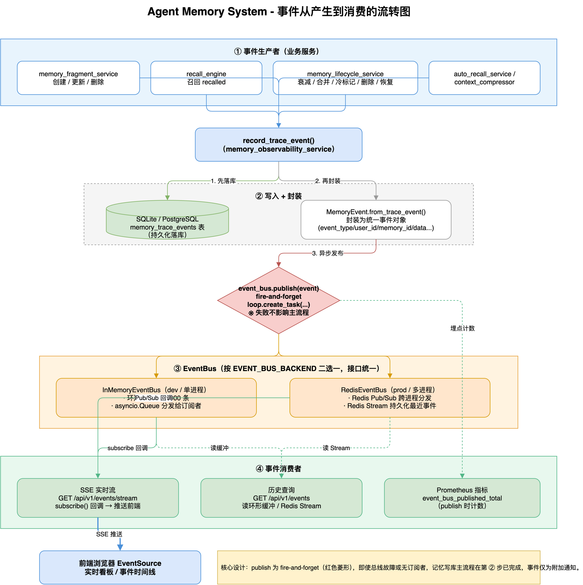
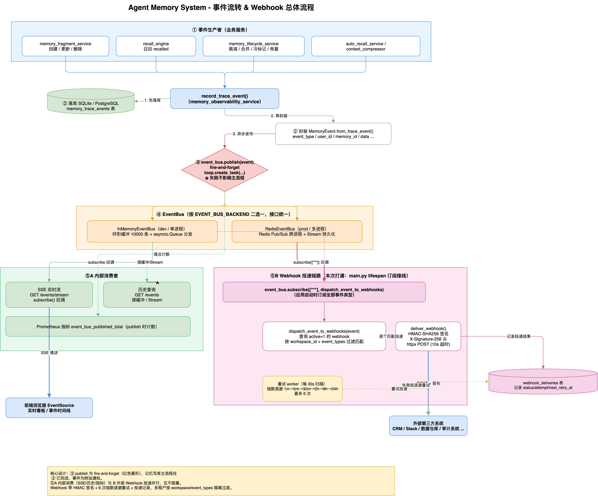

# Agent Memory System - 系统架构设计文档

> **文档版本**：v6.1  ·  **最后更新**：2026-07-30
> 本文档依据项目当前实际实现重写，覆盖后端全部已上线模块。v6.1 为准确性修订版：修正默认管理员密码描述、澄清向量库实际支持范围（仅 ChromaDB 生产可用）、补充 PostgreSQL 方言 FTS5 降级细节、Embedding 切换操作指南、完整 Prometheus 指标清单（22 个）与前端架构细节。v6.0 新增：Embedding Provider 可插拔抽象（default/local + 集合后缀隔离 + 向量重建脚本）、睡眠期记忆巩固（R-11）、Agent 注册与跨 Agent 记忆作用域（R-12）、多模态记忆（R-13）、程序记忆（R-14）、图谱社区检测（R-15，Louvain）、LoCoMo 基准（1540 题四维度）与 A/B 嵌入评测脚本、记忆 Playground、维护任务扩展为 7 步、半衰期类型扩展（multimodal/procedure）。

## 📋 目录

1. [系统概述](#1-系统概述)
2. [总体架构](#2-总体架构)
3. [核心基础设施](#3-核心基础设施)
4. [记忆管理模块](#4-记忆管理模块)
5. [智能检索模块](#5-智能检索模块)
6. [知识图谱模块](#6-知识图谱模块)
7. [记忆生命周期与智能遗忘模块](#7-记忆生命周期与智能遗忘模块)
8. [矛盾检测与演变引擎](#8-矛盾检测与演变引擎)
9. [睡眠期记忆巩固](#9-睡眠期记忆巩固r-11)
10. [程序记忆](#10-程序记忆r-14)
11. [Agent 注册与记忆作用域](#11-agent-注册与记忆作用域r-12)
12. [Agent 与会话模块](#12-agent-与会话模块)
13. [事件总线与 Webhook](#13-事件总线与-webhook)
14. [可观测性与 Playground](#14-可观测性与-playground)
15. [LLM 容错与降级](#15-llm-容错与降级)
16. [多租户与访问控制](#16-多租户与访问控制)
17. [MCP Server](#17-mcp-server)
18. [SDK 生态](#18-sdk-生态)
19. [基准测试](#19-基准测试)
20. [数据流设计](#20-数据流设计)
21. [技术栈](#21-技术栈)
22. [安全架构](#22-安全架构)
23. [部署架构](#23-部署架构)
24. [API 清单](#24-api-清单)
25. [数据库设计](#25-数据库设计)
26. [附录](#26-附录)

---

## 1. 系统概述

### 1.1 产品定位

Agent Memory System 是一套面向 AI Agent 的**完整记忆基础设施**，将「短期上下文、结构化数据、长期语义知识、实体关系图谱、多模态附件、程序化操作经验」统一在一个多租户平台之下，并配套可观测性、事件驱动扩展与 Python / TypeScript SDK、MCP 标准协议接入，解决 AI 应用在会话持久化、知识积累、上下文管理与运维监控方面的核心需求。

### 1.2 核心能力

| 能力域 | 模块 | 说明 |
|--------|------|------|
| 🧠 记忆存储 | 记忆变量 | 轻量级 KV 存储（如 `user_name: "鑫海"`），支持加密与 TTL |
| 📊 记忆存储 | 记忆表 | 动态 Schema 的结构化数据存储，SQL 注入防护 |
| 📝 记忆存储 | 记忆片段 | 带 TTL 与向量嵌入的语义化记忆，支持 FTS5 全文检索；创建时自动触发矛盾检测 |
| 🖼️ 记忆存储 | 多模态记忆（R-13） | 图片上传 → Vision LLM 生成文字描述 → `multimodal` 片段入库；`memory_attachments` 关联原图；无 Vision 时优雅降级为手写描述 |
| 🛠️ 记忆存储 | 程序记忆（R-14） | Agent 工具调用轨迹自动采集（`agent_tool_traces`），LLM 离线提炼为可复用的 `procedure` 操作步骤记忆 |
| 🔍 智能检索 | 自动召回 | 基于语义相似度的记忆检索与上下文注入；P0 多会话聚合 + 时间感知召回 + 知识更新检测；P1 会话分解索引 + 多键索引 + 时间感知查询扩展；支持 Agent 作用域过滤 |
| 🔍 智能检索 | 混合搜索 | 向量 + BM25 + 时间 + 重要度的 RRF 融合检索与重排序；Redis 查询缓存、结果分页、贡献度分析 |
| 🧬 嵌入 | Embedding 抽象 | 可插拔嵌入后端：Chroma 内置默认模型 / 本地 sentence-transformers（BGE 等），集合后缀隔离 + 向量重建脚本 |
| 🕸️ 知识图谱 | 图谱记忆 | 实体/关系抽取、邻居查询、去重合并、图谱统计；**双时序模型**（事件时间 + 系统时间）、时序点查询 API |
| 🌐 知识图谱 | 社区检测（R-15） | networkx Louvain 算法发现实体社区，模块度评估，社区标签自动生成 |
| ♻️ 生命周期 | 记忆生命周期 | 半衰期衰减、冷热分层、归档、软/硬删除、冲突检测与合并；7 步维护任务 |
| 🧹 智能遗忘 | 多因子重要性评分 | 召回频率(0.35) + 时间衰减(0.25) + 证据强度(0.30) + 矛盾惩罚(0.10)；自动遗忘低价值记忆 |
| 😴 巩固 | 睡眠期巩固（R-11） | 离线聚簇相似记忆 + LLM 合并去冗，旧记忆标记 `superseded` 并写入演变链，模拟人类睡眠记忆巩固 |
| 🔄 矛盾检测 | 演变引擎 | 双阶段检测（模式匹配 + ChromaDB 语义检测）；`memory_evolution` 演变链追溯 |
| 📚 长期记忆 | 长期记忆 | 版本控制、自我改进、审计日志 |
| 🤖 Agent | Agent Loop | 工具调用、流式对话、记忆抽取、上下文压缩；LLM 断路器 + 降级标记；工具调用轨迹采集 |
| 🪪 Agent | Agent 注册（R-12） | Agent 实体注册（`agents` 表）与跨 Agent 记忆作用域（`shared`/`private`），私有记忆随 Agent 删除自动转共享 |
| 💬 会话 | 会话管理 | 多轮对话历史、会话摘要、批量操作 |
| 🛡️ 容错 | LLM 容错 | 断路器（CLOSED/OPEN/HALF_OPEN）、进程内异步重试队列、降级标记 `degraded` |
| 🔔 扩展 | 事件 / Webhook | 24 种领域事件、SSE 事件流、Webhook 订阅与投递 |
| 📈 运维 | 可观测性 | 仪表盘、指标历史、追踪、质量评估、性能分析、LLM 韧性端点、业务指标快照、记忆 Playground（注入/召回/衰减模拟） |
| 🏢 平台 | 多租户 / RBAC | 组织/工作区/成员、JWT + API Key、角色权限体系 |
| 🔌 集成 | MCP Server | Model Context Protocol 标准协议，10 个工具（7 记忆管理 + 3 知识图谱），支持 stdio/streamable_http/SSE |
| 🧰 集成 | Python SDK | HTTP / 嵌入两种模式，LangChain 集成 |
| 🧰 集成 | TypeScript SDK | 前端/Node.js 客户端，9 个 API 模块（Variables/Fragments/Tables/Graph/Recall/Workspace/ApiKey/Events/Webhooks） |
| 📊 基准 | LongMemEval | LLM 记忆能力基准测试，P0+P1 优化后 100% 准确率（10/10） |
| 📊 基准 | LoCoMo | 长对话记忆基准（1540 题，多跳/时间/开放域/单跳四维度），A/B 嵌入模型评测脚本 |
| 🗄️ 存储 | PostgreSQL | 方言翻译层适配，支持多副本共享存储，SQLite 无缝切换（FTS5 在 PG 端降级为 LIKE/ILIKE，见 3.2） |
| 🎨 前端 | 性能增强 | 虚拟列表（@tanstack/react-virtual）、Web Worker 图谱计算、Service Worker 离线（vite-plugin-pwa） |

### 1.3 目标用户

- **AI Agent 开发者**：为自定义 Agent 集成记忆能力（通过 SDK / REST / MCP）
- **企业 AI 团队**：构建多租户、可审计、可监控的企业级 AI 知识库
- **研究人员**：LLM 记忆机制、检索融合策略、记忆衰减模型的实验平台

---

## 2. 总体架构

### 2.1 分层视图

```
┌───────────────────────────────────────────────────────────────┐
│  接入层  Frontend 控制台 (React/Vite) · Python SDK · TypeScript │
│         SDK · MCP Server · REST API                             │
└───────────────────────────────────────────────────────────────┘
                              │  HTTP / SSE / stdio
┌───────────────────────────────────────────────────────────────┐
│  API 层  FastAPI Routers (/api/v1/*)                            │
│  auth · memory_* · graph · hybrid_search · lifecycle ·          │
│  observability · agent · agents · sessions · events ·           │
│  webhooks · workspace · memory_evolution · smart_forgetting ·   │
│  memory_consolidation · multimodal · procedures · playground ·  │
│  business_metrics · mcp_server                                  │
└───────────────────────────────────────────────────────────────┘
                              │  依赖注入 (Principal / RBAC)
┌───────────────────────────────────────────────────────────────┐
│  服务层  Services (业务编排)                                     │
│  variable · table · fragment · graph_memory · hybrid_search ·   │
│  lifecycle · smart_forgetting · contradiction · observability · │
│  agent_loop · llm_backend · llm_retry_queue · advanced_recall · │
│  context_compressor · webhook · workspace · api_key · security ·│
│  memory_consolidation · agent_registry · multimodal ·           │
│  tool_trace · procedure_extraction · graph_community            │
└───────────────────────────────────────────────────────────────┘
                              │
┌───────────────────────────────────────────────────────────────┐
│  基础设施层  核心组件                                            │
│  DB(SQLite/PostgreSQL) · Vector(Chroma，Milvus/Qdrant 预留) ·   │
│  Embedding(default/local BGE) · Redis/fakeredis · EventBus ·    │
│  Tracing(OTel) · Metrics(Prom) · Auth/RBAC ·                    │
│  Encryption(AES-256) · CircuitBreaker                           │
└───────────────────────────────────────────────────────────────┘
```

### 2.2 请求生命周期

1. **接入**：客户端（前端 / SDK / MCP）携带 `Authorization: Bearer <jwt|amk_...>` 访问 `/api/v1/*`。
2. **认证**：`get_current_principal` 依赖统一识别 JWT 用户或 API Key，构造 `Principal`。
3. **鉴权**：`require_permission(perm)` 依据角色-权限映射（JWT）或 scopes（API Key）校验。
4. **多租户隔离**：`require_workspace_access` 校验请求 `workspace_id` 与主体一致，防止越权。
5. **业务处理**：Router 调用 Service 层，Service 访问 DB / 向量库 / Redis。
6. **副作用**：写操作发布领域事件到 EventBus → 触发 Webhook 投递 / 指标更新 / 追踪 Span。
7. **响应**：返回 JSON 或 SSE 流；Prometheus 记录延迟与计数。

### 2.3 启动与生命周期（`lifespan`）

后端在 `app.main` 的 `lifespan` 中按序初始化并在关闭时优雅回收：

```
启动:  init_tracing → start_lifecycle_scheduler → event_bus.start
       → start_webhook_worker → start_retry_worker
关闭:  stop_retry_worker → stop_webhook_worker → event_bus.stop
       → stop_lifecycle_scheduler
```

- `init_tracing`：按 `ENABLE_TRACING` 与 `OTLP_ENDPOINT` 初始化 OpenTelemetry，未启用则降级为 NoOp。
- `start_lifecycle_scheduler`：后台定时任务，驱动 7 步维护流程（归档、清理、去重、智能遗忘、睡眠期巩固、时序失效扫描、程序记忆提炼，详见 7.5 节）。
- `event_bus.start`：启动 InMemory 或 Redis 事件总线。
- `start_webhook_worker`：启动 Webhook 异步投递工作线程。
- `start_retry_worker`：启动 LLM 异步重试队列工作协程（详见第 15 节）。

---

## 3. 核心基础设施

### 3.1 集中配置（`app/core/config.py`）

采用 `pydantic-settings`，配置优先级：**环境变量 > `.env` 文件 > 默认值**。关键配置项：

| 分类 | 配置项 | 默认值 | 说明 |
|------|--------|--------|------|
| 关系库 | `DATABASE_URL` | `sqlite:///agent_memory.db` | 主数据库 |
| 关系库 | `DB_POOL_SIZE` / `DB_ECHO` | `10` / `False` | 连接池 / SQL 回显 |
| 向量库 | `VECTOR_BACKEND` | `chroma` | 当前仅 `chroma` 生产可用（`milvus`/`qdrant` 为预留值，见 3.3） |
| 向量库 | `CHROMA_PERSIST_DIR` | `./chromadb_data` | Chroma 持久化目录 |
| 嵌入 | `EMBEDDING_PROVIDER` | `default` | `default`（Chroma 内置）\| `local`（sentence-transformers） |
| 嵌入 | `EMBEDDING_MODEL` | `BAAI/bge-small-zh-v1.5` | 本地嵌入模型（仅 `local` 生效） |
| 嵌入 | `EMBEDDING_DEVICE` / `EMBEDDING_BATCH_SIZE` | `cpu` / `32` | 推理设备（cpu/cuda/mps）/ 批处理大小 |
| 缓存/总线 | `REDIS_URL` | `""` | 为空则用内存实现（支持 `fakeredis://`） |
| 事件 | `EVENT_BUS_BACKEND` | `memory` | `memory \| redis` |
| 认证 | `JWT_SECRET_KEY` / `JWT_ALGORITHM` / `JWT_EXPIRATION_HOURS` | `""` / `HS256` / `24` | JWT 配置 |
| 认证 | `PBKDF2_ITERATIONS` | `200000` | 密码哈希迭代次数 |
| 加密 | `ENCRYPTION_PASSWORD` / `ENCRYPTION_SALT` | `""` | AES-256 密钥派生 |
| 监控 | `ENABLE_METRICS` / `ENABLE_TRACING` | `True` / `False` | Prometheus / OTel 开关 |
| 监控 | `OTLP_ENDPOINT` | `""` | OTLP Collector 地址 |
| 日志 | `LOG_LEVEL` / `LOG_JSON` | `INFO` / `False` | 生产建议 `LOG_JSON=True` |
| LLM | `DEEPSEEK_API_KEY` / `DEEPSEEK_BASE_URL` / `DEEPSEEK_MODEL` | `""` | LLM 后端 |
| LLM | `LLM_TIMEOUT_SECONDS` / `LLM_RETRY_DELAYS` | `30` / `2,8,30` | 超时（秒）/ 重试延迟 |
| 服务 | `HOST` / `PORT` | `0.0.0.0` / `8000` | 监听地址 |
| 调度器 | `OUTBOX_SCHEDULER_INTERVAL` / `LIFECYCLE_SCHEDULER_INTERVAL` | `30` / `30` | Outbox / 生命周期调度间隔（秒） |
| 调度器 | `OUTBOX_MAX_RETRIES` | `5` | Outbox 最大重试次数 |
| 限流 | `RATE_LIMIT_REQUESTS` / `RATE_LIMIT_WINDOW_SECONDS` | `100` / `60` | 请求限流阈值 / 窗口 |
| 缓存 | `HYBRID_SEARCH_CACHE_TTL` / `STATS_CACHE_TTL` | `300` / `60` | 混合搜索 / 统计接口缓存 TTL |
| 生命周期 | `COLD_MEMORY_THRESHOLD_DAYS` / `DEFAULT_HALF_LIFE_DAYS` | `30` / `30` | 冷记忆阈值 / 默认半衰期 |
| 巩固 | `CONSOLIDATION_ENABLED` | `True` | 睡眠期巩固总开关；LLM 不可用/mock 时自动降级跳过 |
| 巩固 | `CONSOLIDATION_SIMILARITY_THRESHOLD` | `0.80` | 聚簇相似度阈值 |
| 巩固 | `CONSOLIDATION_MIN_CLUSTER_SIZE` / `CONSOLIDATION_MAX_CLUSTERS_PER_RUN` | `2` / `10` | 最小簇大小 / 单轮最多处理簇数（LLM 成本上限） |
| 巩固 | `CONSOLIDATION_MIN_AGE_HOURS` / `CONSOLIDATION_MAX_CANDIDATES_PER_RUN` | `24` / `200` | 只巩固超过 N 小时的记忆 / 单轮候选上限（最旧优先） |
| 多模态 | `MULTIMODAL_ENABLED` / `MULTIMODAL_UPLOAD_DIR` | `True` / `data/uploads` | 多模态开关 / 图片存储目录 |
| 多模态 | `MULTIMODAL_MAX_FILE_SIZE_MB` / `MULTIMODAL_ALLOWED_EXTENSIONS` | `10` / `jpg,jpeg,png,gif,webp` | 单文件上限 / 允许扩展名 |
| 多模态 | `VISION_MODEL` | `""` | Vision 模型（空 = 复用 `DEEPSEEK_MODEL`） |
| 程序记忆 | `PROCEDURE_EXTRACTION_ENABLED` | `True` | 轨迹提炼总开关；LLM 不可用/mock 时自动降级跳过 |
| 程序记忆 | `PROCEDURE_MIN_TRACE_CALLS` / `PROCEDURE_MAX_SESSIONS_PER_RUN` | `2` / `20` | 提炼门槛（工具调用次数）/ 单轮提炼会话上限 |
| 社区检测 | `COMMUNITY_DETECTION_RESOLUTION` | `1.0` | Louvain resolution（越大社区越小越多） |
| 社区检测 | `COMMUNITY_MIN_SIZE` | `2` | 最小社区大小（单点社区不入库） |
| MCP | `MCP_ENABLED` / `MCP_TRANSPORT` | `True` / `stdio` | MCP Server 开关 / 传输方式（`stdio \| sse \| streamable_http`） |
| MCP | `MCP_HOST` / `MCP_PORT` | `127.0.0.1` / `8765` | MCP HTTP/SSE 监听地址与端口 |
| MCP | `MCP_REQUIRE_AUTH` / `MCP_DEFAULT_USER_ID` | `False` / `1` | MCP 是否强制认证（生产建议 `True`）/ 无认证时默认用户 |

配置通过 `get_settings()` 以 `lru_cache` 单例暴露。

### 3.2 关系型数据库（`app/core/db_client.py` / `app/core/pg_client.py`）

- **双后端支持**：默认 **SQLite（WAL 模式）**，可通过 `DATABASE_URL` 切换为 **PostgreSQL**。
- **SQLite**：兼顾单机部署简单性与并发读写，通过 `db_client` 统一执行参数化 SQL（`?` 占位符）。
- **PostgreSQL 适配器（R-03）**：
  - `PostgresClient` 实现与 `SQLiteClient` 相同的公开接口（`execute` / `get_cursor`），20+ 依赖 `get_db_client()` 的服务无需改动即可切换后端。
  - **方言翻译层**：自动将 SQLite 方言的裸 SQL 翻译为 PostgreSQL 等价语法：
    - `?` → `%s`（psycopg2 占位符）
    - `INTEGER PRIMARY KEY AUTOINCREMENT` → `SERIAL PRIMARY KEY`
    - `TEXT(n)` → `TEXT`、`datetime('now')` → `NOW()`
    - `INSERT OR IGNORE` → `INSERT ... ON CONFLICT DO NOTHING`
    - `ALTER TABLE ADD COLUMN` → `ADD COLUMN IF NOT EXISTS`（幂等补列）
  - 线程局部连接 + `_TranslatingCursor` 模拟 SQLite 的 `lastrowid`（为 INSERT 追加 `RETURNING id`）。
  - 支持多副本共享存储，适合生产横向扩展。
  - **已知限制（FTS5 降级）**：SQLite FTS5 虚拟表（`fragments_fts`）在 PG 端不创建，混合搜索的 BM25 通道自动降级为 **LIKE / ILIKE 关键词检索**（`_search_with_like`，无 BM25 相关性评分，PG 下使用 `ILIKE` 保持与 SQLite `LIKE` 一致的大小写不敏感语义）；`rebuild-index` 接口在非 SQLite 后端直接返回空操作提示。tsvector 全文检索列入后续项，当前未实现。另 `INSERT OR REPLACE` 仅做尽力翻译。
- `init_db.py` 负责建表与初始化。初始管理员账号为 `admin`，初始密码以 `backend/README.md` 记载为准（实际默认值为 `Admin123!`，**并非**早期文档所写的 `admin123`）；该值仅为种子默认值而非推荐配置，生产环境首次登录后必须立即修改。
- 结构化记忆表的动态 DDL 经 `sql_safety.py` 校验标识符白名单，防注入。

### 3.3 向量数据库（`app/core/chromadb_client.py` / `milvus_client.py` / `store/`）

- **当前唯一生产可用后端为 ChromaDB**（本地持久化，`CHROMA_PERSIST_DIR`），业务服务直接经 `chromadb_client` 访问。
- **Milvus / Qdrant 支持范围澄清**：
  - `milvus_client.py` 提供独立的 Milvus 连接管理模块（连接 / Collection / 插入 / 搜索），但**尚未接入** Store 工厂（`store/factory.py` 的 `_VECTOR_MAP` 仅注册 `chroma`）与任何业务链路；
  - Qdrant 仅有配置占位（`QDRANT_URL`），**无客户端实现**；
  - 将 `VECTOR_BACKEND` 配置为 `milvus` / `qdrant` 会在 Store 工厂抛出「未知的向量存储后端」错误。二者均属预留扩展点（`store/base.py` 的 `VectorStore` 抽象为其铺路）。
- 为记忆片段、图谱实体、召回等提供向量写入与相似度检索。
- 集合名称随嵌入模型追加后缀隔离（见 3.12），避免不同嵌入模型的向量混用。

### 3.4 Redis / 事件总线（`app/core/redis_client.py`）

- Redis 用于缓存、事件总线（Redis 模式）与限流等；开发环境支持 `fakeredis://` 免依赖运行。
- `EVENT_BUS_BACKEND` 决定使用 `InMemoryEventBus` 还是 `RedisEventBus`。

### 3.5 认证主体（`app/core/auth.py`）

统一认证主体 `Principal`（dataclass）：

```python
@dataclass
class Principal:
    user_id: int
    workspace_id: Optional[int] = None
    scopes: List[str] = field(default_factory=list)
    auth_method: str = "jwt"        # "jwt" | "api_key"
    api_key_id: Optional[int] = None
    def has_scope(self, scope: str) -> bool: ...
```

- `get_current_principal`：识别 `amk_` 前缀走 API Key 分支（`validate_api_key`），否则走 JWT 分支。
- **密码哈希**：PBKDF2-HMAC-SHA256，格式 `{iterations}${salt}${hash}`，兼容旧 10000 迭代格式。
- **EncryptionService**：基于 Fernet 的 AES-256 单例，从 `ENCRYPTION_PASSWORD/SALT` 派生密钥，用于敏感记忆值加密。

### 3.6 RBAC（`app/core/rbac.py`）

- **权限常量 `Perm`**：`memory:read/write/delete/admin`、`workspace:read/write/admin`、`api_key:manage`。
- **角色-权限映射 `ROLE_PERMISSIONS`**：`owner`（全部）/ `admin`（除 workspace:admin）/ `member`（读写删 + workspace:read）/ `viewer`（只读）。
- **`require_permission(perm)`**：JWT 用户按 workspace 角色约束；API Key 严格按 scopes 校验。
- **`require_workspace_access`**：校验路径 `workspace_id` 与主体可访问空间一致，防止跨租户越权。

### 3.7 可观测基础组件

- **追踪 `app/core/tracing.py`**：OpenTelemetry 封装，未启用时降级为 `_NoOpSpan`（含 `end()`）。
- **指标 `app/core/metrics.py`**：Prometheus 客户端，暴露 `/metrics` 端点（`ENABLE_METRICS` 时），未安装时以 Stub 降级。
- **日志**：结构化日志（`log_setup.py`），支持 `LOG_JSON` 输出便于集中采集。

### 3.8 断路器（`app/core/circuit_breaker.py`）

LLM 调用路径上的**三态断路器**，线程安全（`threading.Lock`），按 `(user_id, backend_name)` 粒度维护：

| 状态 | 行为 |
|------|------|
| `CLOSED` | 正常放行；失败计数达 `failure_threshold=5` → 转 `OPEN` |
| `OPEN` | 直接拒绝；`recovery_timeout=60s` 后 → 转 `HALF_OPEN` |
| `HALF_OPEN` | 放行 `half_open_max_calls=1` 次探测；成功 → `CLOSED`，失败 → `OPEN` |

- `CircuitBreaker`：暴露 `allow() / record_success() / record_failure()`。
- `CircuitBreakerRegistry`：按 `(user_id, backend_name)` 管理实例；`get(key)` / `snapshot()`（供可观测端点读取）。
- 时间基准：`time.monotonic()` 惰性恢复，避免依赖系统时钟。

### 3.9 错误模型与版本化（`app/core/errors.py` / `versioning.py`）

- **统一异常 `AppException`**：携带 `ErrorCode` 枚举与 HTTP 状态码，由 `main.py` 的全局异常处理器转换为标准 `ErrorResponse`。
- **端点稳定性 `EndpointStability`**：为每个 Router 标注 `stable / beta / alpha / deprecated`，`resolve_stability` 在响应头注入 `Sunset` / `Deprecation` 字段，支撑 API 演进的可观测性。
- **`handle_service_result` 装饰器**：消除 API 层重复的 `try/except/raise HTTPException` 模式。自动处理 service 返回的 `{"success": False, "error": ...}` 格式，根据错误内容智能推断 HTTP 状态码（404/409/403/400），未预期异常转为 500。

### 3.10 TTL 缓存装饰器（`app/core/cache.py`）

为统计类接口提供简单 TTL 缓存，优先 Redis，不可用时回退进程内字典。

- **`@ttl_cache(ttl=60, key_prefix="")`**：装饰器自动缓存函数返回值，仅缓存 `success != False` 的结果。
- 缓存键基于 `key_prefix` + 函数参数 MD5 哈希。
- 提供 `wrapper.cache_clear(*args)` 方法手动清除缓存。
- 已应用于：`get_dashboard_stats`（60s）、`get_quality_report`（120s）、`get_lifecycle_stats`（60s）、`get_graph_statistics`（60s）。

### 3.11 统一响应信封（`app/core/response.py`）

为新建接口提供标准化响应格式：

```python
{
    "success": bool,           # 请求是否成功
    "data": Any | None,        # 成功时的数据载荷
    "error": str | None,       # 失败时的错误信息
    "trace_id": str | None,    # 请求追踪 ID（自动从上下文获取）
    "meta": dict | None        # 元信息（分页、计数等）
}
```

- `ok(data, meta)` / `fail(error, code)` / `paginate(items, total, page, page_size)` 三个辅助函数。
- trace_id 自动从 `request_id_middleware` 上下文获取。
- 现有接口保持向后兼容，新接口推荐使用。

### 3.12 Embedding Provider 抽象（`app/core/embedding.py`）

可插拔嵌入后端抽象，支持在 Chroma 内置默认模型与本地 sentence-transformers 模型间切换：

| 组件 | 说明 |
|------|------|
| `LocalEmbeddingProvider` | 封装 sentence-transformers，**懒加载**模型（首次调用才加载权重），按 `EMBEDDING_DEVICE` / `EMBEDDING_BATCH_SIZE` 推理 |
| `ChromaEmbeddingFunction` | 适配 Chroma `EmbeddingFunction` 协议，将本地 Provider 注入集合创建 |
| `get_embedding_provider()` / `get_embedding_function()` | 按 `EMBEDDING_PROVIDER` 返回对应实现（`default` 返回 None，走 Chroma 内置） |
| `get_collection_suffix()` | `local` 模式返回 `__<model-slug>` 后缀（如 `memory_fragments__bge-small-zh-v1-5`），实现**集合级隔离**，不同嵌入模型的向量互不污染 |
| `reset_embedding_provider()` | 重置单例（测试/热切换用） |

- **BGE 中文模型查询指令前缀**：查询侧自动添加「为这个句子生成表示以用于检索相关文章：」，文档侧不加，符合 bge-zh 系列的非对称检索最佳实践。
- **向量重建**：切换嵌入模型后运行 `backend/scripts/reindex_vectors.py`，从 `memory_fragments` 读取全部未删除/未过期片段，批量重新嵌入写入新后缀集合（**范围仅记忆片段**，不含图谱实体向量；旧集合保持不动）。按 `fragment_id` 先删后写，**幂等**，重复运行不产生重复向量。
- **A/B 评测**：`scripts/run_ab_benchmarks.sh` 支持 default 与 local(BGE) 两种嵌入在 LongMemEval / LoCoMo 上的对照评测（见第 19 节）。

**Embedding 切换操作指南**（default → local BGE 示例）：

```bash
# 1. 安装本地嵌入依赖（local 模式必需）
pip install sentence-transformers

# 2. 预览待重建的片段数量与目标集合（不写入）
cd backend
EMBEDDING_PROVIDER=local python scripts/reindex_vectors.py --dry-run

# 3. 实际重建全量向量索引（写入新后缀集合，旧集合不动）
EMBEDDING_PROVIDER=local python scripts/reindex_vectors.py

# 4. 以相同嵌入配置重启服务
EMBEDDING_PROVIDER=local EMBEDDING_MODEL=BAAI/bge-small-zh-v1.5 \
  python -m uvicorn app.main:app --host 0.0.0.0 --port 8000
```

> 注意：服务运行时的 `EMBEDDING_PROVIDER`/`EMBEDDING_MODEL` 必须与重建脚本执行时一致，否则读写将落在不同后缀集合导致检索为空；回滚只需还原环境变量重启（旧集合仍在）。

---

## 4. 记忆管理模块

记忆管理是系统的存储核心，分为多类互补的记忆形态，均以 `workspace_id` 隔离并支持事件发布。

### 4.1 记忆变量（`memory_variable_service.py` · `/api/v1/memory`）

- **定位**：轻量级 KV 记忆，适合用户偏好、会话状态等短小事实。
- **特性**：
  - 支持 TTL 过期。
  - 敏感值可经 `EncryptionService` AES-256 加密存储。
  - 类型标注（string / number / json 等）。
- **接口**：变量的增删改查、批量列举。

### 4.2 记忆表（`memory_table_service.py` · `/api/v1/memory/tables`）

- **定位**：动态 Schema 的结构化数据存储，等价于用户可自定义的「业务数据表」。
- **特性**：
  - 运行期创建表并定义列（动态 DDL）。
  - **SQL 注入防护**：所有表名/列名经 `sql_safety.py` 白名单校验，值走参数化绑定。
  - 记录级 CRUD、条件查询、事件发布（`table.created/dropped/record_*`）。
- **自然语言查询**：`natural_language_query_service.py` 支持将自然语言转换为结构化表查询。

### 4.3 记忆片段（`memory_fragment_service.py` · `/api/v1/memory/fragments`）

- **定位**：带 TTL 与向量嵌入的语义化记忆单元，是长期知识与语义检索的载体。
- **特性**：
  - 写入时生成向量嵌入并存入向量库；同时写入 `memory_fragments_fts`（SQLite FTS5）支持全文检索。
  - 支持重要度（importance）、标签、来源等元数据。
  - 支持 `agent_id` / `scope`（`shared` / `private`）标注归属 Agent 与可见性（R-12，见第 11 节）。
  - 与生命周期模块联动（半衰期衰减、归档、软删除）。
  - **跨存储事务一致性（Outbox Pattern）**：SQLite 业务数据与 `vector_outbox` 记录在同一事务内写入，后台 worker 每 30 秒处理 pending 记录并写入 ChromaDB，指数退避重试（最大 5 次）。`memory_fragments.vector_synced` 标记向量同步状态。乐观执行策略：先尝试立即写入向量库，失败则由 outbox 补偿。

### 4.4 长期记忆（`long_term_memory_service.py` · `/api/v1/memory/long-term`）

- **定位**：面向知识演进的高阶记忆管理。
- **特性**：版本控制、自我改进（基于反馈迭代）、审计日志，追踪知识随时间的变化。

### 4.5 记忆抽取（`memory_extraction_service.py` / `llm_extraction_service.py` · `/api/v1/memory/extraction`）

- **定位**：从对话/文本中自动抽取结构化记忆并注入存储。
- **接口**：`process`（抽取）、`inject`（注入）、`generate`、`batch-extract`、`context`、`summary`、`feedback`、`templates`、`preview`。
- **可配置提示词模板**（`extraction_prompt_templates` 表），并支持反馈闭环（`extraction_feedback` 表）。

### 4.6 多模态记忆（R-13 · `multimodal_service.py` · `/api/v1/memory/multimodal`）

- **定位**：将图片等视觉信息转化为可检索的文字描述记忆，原始文件以附件形式关联保存。
- **写入流程**：

```
POST /memory/multimodal/upload (multipart)
  → 校验开关/扩展名/文件大小 (MULTIMODAL_* 配置)
  → uuid 重命名落盘到 MULTIMODAL_UPLOAD_DIR
  → 生成描述: 用户手写描述优先 → 否则 llm_vision_chat(VISION_MODEL) 生成
  → create_fragment(fragment_type='multimodal')  # 走全部标准片段流程(向量/FTS/事件)
  → 写入 memory_attachments 附件行
```

- **优雅降级**：Vision 模型不可用且用户未提供描述时，上传失败并**清理已落盘文件**，提示用户手写描述重试。
- **半衰期**：`multimodal` 类型记忆永不衰减（`HALF_LIFE_CONFIG` 中为 `None`，见 7.5 节）。
- **API 端点**：

| 端点 | 方法 | 说明 |
|------|------|------|
| `/memory/multimodal/upload` | POST | 上传图片 + 可选描述，创建多模态记忆 |
| `/memory/multimodal/attachments` | GET | 附件列表（含所属片段） |
| `/memory/multimodal/attachments/{id}/download` | GET | 下载原图（`FileResponse`，带归属校验） |
| `/memory/multimodal/attachments/{id}` | DELETE | 删除附件（级联删除关联片段与文件） |

- **数据落地**：`memory_attachments`（`fragment_id` / `file_name` / `stored_path` / `mime_type` / `file_size` / `caption_source`（`manual` \| `vision`））。

---

## 5. 智能检索模块

### 5.1 自动召回（`auto_recall_service.py` / `recall_engine.py` · `/api/v1/memory/recall`）

- **定位**：基于语义相似度，从记忆片段中检索与当前上下文相关的记忆，用于上下文注入。
- **特性**：
  - 可配置召回策略（`recall_config` 表）：相似度阈值、Top-K、时间窗口等。
  - **Agent 作用域过滤**（R-12）：`apply_agent_scope_filter()` 确保 Agent 只能召回共享记忆与自己的私有记忆。
  - 命中率、召回延迟等指标接入 Prometheus。

### 5.2 混合搜索（`hybrid_search_service.py` · `/api/v1/memory/hybrid-search`）

- **定位**：多路召回融合检索，兼顾语义、关键词、时效与重要度。
- **融合策略**：
  - **向量检索**（语义）+ **BM25**（关键词，基于 SQLite FTS5；PostgreSQL 后端无 FTS5，自动降级为 LIKE/ILIKE 关键词检索，见 3.2；中文查询在 SQLite 下也有 LIKE 回退路径）+ **时间衰减** + **重要度加权**。
  - 通过 **RRF（Reciprocal Rank Fusion）** 融合多路排序结果。
  - 权重可配置：`alpha`（向量）/ `beta`（BM25）/ `gamma`（时间）/ `delta`（重要度）。
  - 支持结果 **重排序（rerank）**。
- **查询缓存（P1）**：
  - `HYBRID_SEARCH_CONFIG` 提供 `cache_enabled: True` / `cache_ttl: 300s` / `cache_version: 1`。
  - 缓存键 `_cache_key(user_id, query, weights, top_k, workspace_id)` 对参数做稳定 JSON 序列化后 `SHA256`，前缀 `hybrid_search:cache:{version}:`。
  - 缓存整份融合排序列表（rerank 前的精简字段 + rerank 结果），供分页切片。
  - Redis 不可用时静默跳过缓存（复用现有 try/except 降级风格）。
  - `update_config` / `set_weights` 成功后自增 `cache_version` 使旧缓存自然失效。
- **结果分页（P1）**：
  - 新增 `offset` / `limit` 参数，在缓存的融合排序列表上切片。
  - 返回体新增 `total` / `offset` / `limit` / `has_more`，候选池大小受 `semantic_top_k + bm25_top_k` 约束，超出返回空并 `has_more=False`。
- **贡献度分析（P1）**：
  - `analyze_search(user_id, query, workspace_id)` 复用检索流程，返回：
    - 每个候选的 `_signal_breakdown`（各信号贡献）。
    - 各信号命中数与重叠（`semantic_only` / `bm25_only` / `both` 计数）。
    - 权重敏感度（对 `alpha/beta/gamma/delta` 各 ±0.1，**使用已有 `_signal_breakdown` 在本地重算融合分排名**，无需重复搜索，分析耗时从 60s 降至 1.2s）。
- **接口**：`hybrid-search`、`bm25`、`rerank`、`config`（GET/PUT）、`rebuild-index`、`analyze`（POST）。
- **指标**：`hybrid_search_seconds`、`hybrid_search_result_count`。

---

## 6. 知识图谱模块

### 6.1 概述（`graph_memory_service.py` · `/api/v1/memory/graph`）

将记忆升维为**实体-关系图谱**，支持从文本抽取实体与关系、维护图结构、按关系游走查询，并对实体做去重合并与社区发现。

### 6.2 核心能力

| 能力 | 接口 | 说明 |
|------|------|------|
| 实体 CRUD | `entities`（POST/GET/GET{id}/PUT{id}/DELETE{id}） | 创建/查询/更新/删除实体 |
| 实体合并 | `entities/merge` | 合并重复实体，保留关系 |
| 关系 CRUD | `relationships`（POST/GET/GET{id}/PUT{id}/DELETE{id}） | 基于**实体名称**创建关系（`source_name`/`target_name`/`relation_type`/`source_type`/`target_type`）；创建时自动写入 `observed_at`（系统时间） |
| 关系停用 | `relationships/{id}/deactivate` | 结束关系，同时写入 `valid_to`（事件时间）和 `expired_at`（系统时间），支持自定义 `ended_at` |
| 邻居查询 | `neighbors` | 查询实体的直接关联实体 |
| **时序点查询** | `temporal` | **双时序模型**查询：返回在指定时间点成立的关系，支持 `event`（事件时间）和 `system`（系统时间）两种模式 |
| 关系历史 | `history` | 关系变更历史（`graph_relationship_history` 表），含 `observed_at`/`expired_at` |
| 抽取 | `extract` | 从文本中抽取实体与关系 |
| 图查询 | `query` | 图结构查询 |
| 去重 | `duplicates` | 发现潜在重复实体 |
| 统计 | `statistics` | 实体/关系规模统计 |
| **社区检测** | `communities/detect` · `communities` · `communities/stats` | Louvain 社区发现（R-15，见 6.5） |

### 6.3 双时序模型（R-04）

`graph_relationships` 表采用**双时序模型**（Bi-Temporal），区分事件时间与系统时间：

| 时间维度 | 字段 | 含义 | 查询场景 |
|----------|------|------|----------|
| **事件时间** | `valid_from` / `valid_to` | 关系在现实世界中生效/结束的时间 | "2026-06-01 时 Alice 在哪家公司？" |
| **系统时间** | `observed_at` / `expired_at` | 系统首次观测到/过期该关系的时间 | "昨天系统知道 Alice 在哪家公司？" |

**时序点查询 API**（`GET /memory/graph/temporal`）：

- **event 模式**：基于 `valid_from <= at_time AND (valid_to IS NULL OR valid_to > at_time)` 判断关系在该时刻是否为真
- **system 模式**：基于 `observed_at <= at_time AND (expired_at IS NULL OR expired_at > at_time)` 判断系统在该时刻是否已观测到该关系
- 支持按源/目标实体名称、关系类型过滤

**演变追踪**：`deactivate_relationship` 结束关系时，同时设置 `valid_to`（可自定义事件时间）和 `expired_at`（系统当前时间），并在 `graph_relationship_history` 中记录完整变更。

### 6.4 数据落地

- `graph_entities` / `graph_relationships`（含双时序四字段）/ `graph_relationship_history`（含双时序四字段）。
- 实体可写入向量库以支持语义去重与相似实体发现。
- 变更发布 `graph.entity_created/entity_updated/relationship_created/relationship_deleted` 事件。

### 6.5 社区检测（R-15 · `graph_community_service.py`）

基于 **networkx Louvain 算法**在实体关系图上发现主题社区，为图谱提供宏观结构视图：

**检测流程**：

```
POST /memory/graph/communities/detect
  → 加载活跃实体 + 未过期关系 (expired_at IS NULL)
  → 构建 nx.Graph: 边权 = 关系 confidence, 平行边取 max
  → louvain_communities(resolution=COMMUNITY_DETECTION_RESOLUTION, seed=42)  # 结果可复现
  → 计算 modularity（模块度，衡量社区划分质量）
  → 过滤小社区 (< COMMUNITY_MIN_SIZE)
  → 覆盖式写入 graph_communities + 记录 graph_community_runs
```

- **社区标签**：取社区内**度数 Top3** 实体名称拼接生成（如 `Alice · Acme · 北京`）。
- **可复现性**：`seed=42` 固定随机种子，相同图结构多次检测结果一致。
- **API 端点**：

| 端点 | 方法 | 说明 |
|------|------|------|
| `/memory/graph/communities/detect` | POST | 触发社区检测（返回社区数/模块度/节点边规模） |
| `/memory/graph/communities` | GET | 最新一次检测的社区列表（含成员实体） |
| `/memory/graph/communities/stats` | GET | 历次检测统计 |

- **数据落地**：`graph_community_runs`（`algorithm` / `resolution` / `communities_found` / `modularity` / `node_count` / `edge_count` / `status`）+ `graph_communities`（`run_id` / `community_index` / `entity_ids` JSON / `entity_count` / `label`）。

---

## 7. 记忆生命周期与智能遗忘模块

### 7.1 概述（`memory_lifecycle_service.py` · `/api/v1/memory/lifecycle`）

模拟人类记忆的「遗忘曲线」，对记忆进行**衰减、分层、归档、删除、合并与冲突处理**的全生命周期治理，由后台调度器（`start_lifecycle_scheduler`）定时驱动。

### 7.1.1 状态源规范（Single Source of Truth）

- `memory_fragments.lifecycle_status` 是记忆生命周期的**唯一权威状态来源**。
- `memory_lifecycle` 表仅作为**事件审计日志**，记录状态变更历史。
- 查询记忆状态时，使用 `COALESCE(f.lifecycle_status, lc.lifecycle_status)` 优先读取 fragment 状态。
- 对于 variable 类型记忆（无对应 fragment 行），回退到 `memory_lifecycle.lifecycle_status`。
- 状态变更时，必须同时更新两表以保持一致性。

### 7.2 核心能力

| 能力 | 接口 | 说明 |
|------|------|------|
| 半衰期 | `half-life/{type}` | 按记忆类型配置衰减半衰期 |
| 统计 | `stats` | 生命周期整体统计 |
| 冷数据 | `cold` / `cold/mark` | 查询/标记冷记忆 |
| 已删除 | `deleted` | 查询已软删除记忆 |
| 归档 | `{type}/{id}/archive` | 归档指定记忆 |
| 删除 | `soft-delete` / `restore` / `hard-delete` | 软删除 / 恢复 / 硬删除 |
| 自动化 | `auto-archive` / `run-cleanup` | 自动归档 / 手动触发清理 |
| 审计 | `delete-log` / `merge-log` | 删除/合并审计日志 |
| 去重 | `duplicates/find` / `duplicates/merge` | 发现/合并重复记忆 |
| 冲突 | `conflicts/detect` / `conflicts` / `conflicts/resolve` | 检测/列举/解决记忆冲突 |

### 7.3 数据落地

- `memory_lifecycle`（衰减状态）、`memory_delete_log`、`memory_merge_log` 三张表。
- 状态流转发布 `memory.decayed/merged/cold_marked/restored/deleted` 事件。
- 指标：`lifecycle_actions_total`。

### 7.4 智能遗忘机制（R-07 · `smart_forgetting_service.py` · `/api/v1/memory/forgetting`）

在传统 TTL 过期 + 冷热分层 + 半衰期衰减之上，新增**基于多因子重要性评分的智能遗忘**：

**重要性评分公式**：

```
importance = 0.35 × recall_frequency + 0.25 × time_decay + 0.30 × evidence + 0.10 × contradiction
```

| 因子 | 权重 | 数据来源 | 说明 |
|------|------|----------|------|
| 召回频率 | 0.35 | `memory_trace_events` 中 `recalled` 事件次数 | 对数归一化：`log(1+count) / log(1+N)`，N=10 |
| 时间衰减 | 0.25 | `calculate_decay_score`（半衰期指数衰减） | 永久类型（info/multimodal）不衰减，返回 1.0 |
| 证据强度 | 0.30 | `memory_fragments.importance_score` | 用户/系统设定的原始重要性 |
| 矛盾惩罚 | 0.10 | `lifecycle_status == 'superseded'` | 被矛盾检测标记的记忆获得 0 分惩罚 |

**核心函数**：

| 函数 | 说明 |
|------|------|
| `compute_importance_score` | 计算单条记忆的多因子评分，返回总分 + 各因子分解 |
| `recalculate_importance` | 批量重算所有 active 记忆，更新 `importance_score`，自动遗忘低于阈值的记忆 |
| `get_importance_breakdown` | 查询单条记忆的评分因子分解 |
| `get_forgetting_statistics` | 获取评分分布与状态统计 |

**自动遗忘流程**：
- `recalculate_importance` 批量扫描 active 记忆
- 批量获取召回次数（`memory_trace_events`）和 superseded 状态
- 评分低于 `forget_threshold`（默认 0.15）的记忆自动调用 `mark_cold` 标记为冷记忆
- 集成到维护流程第 4 步（见 7.5）

**API 端点**：

| 端点 | 方法 | 说明 |
|------|------|------|
| `/memory/forgetting/recalculate` | POST | 手动触发重要性重算（可配 `auto_forget` / `forget_threshold`） |
| `/memory/forgetting/importance/{id}` | GET | 查询单条记忆的因子分解 |
| `/memory/forgetting/statistics` | GET | 遗忘统计（状态分布 + 评分分布） |
| `/memory/forgetting/config` | GET | 权重配置与公式说明 |

### 7.5 按类型半衰期与 7 步维护流程

**`HALF_LIFE_CONFIG` 按记忆类型的半衰期配置**：

| 记忆类型 | 半衰期 | 说明 |
|----------|--------|------|
| `info` | `None`（永久） | 事实性信息不随时间失效 |
| `plan` | 90 天 | 计划类记忆中期有效 |
| `preference` | 1 天 | 偏好高频变化，快速衰减 |
| `multimodal` | `None`（永久） | 图片描述类记忆不衰减（R-13） |
| `procedure` | 180 天 | 操作步骤经验长期有效但工具会演进（R-14） |
| 其他 | `DEFAULT_HALF_LIFE_DAYS`（30 天） | 默认半衰期 |

**`run_maintenance_now` 7 步维护流程**（由生命周期调度器定时触发，也可手动执行）：

| 步骤 | 任务 | 守卫开关 |
|------|------|----------|
| ① | 归档冷记忆（自动归档超过冷阈值的记忆） | — |
| ② | 清理过期记忆（TTL 到期） | — |
| ③ | 去重扫描（发现并合并重复记忆） | — |
| ④ | 智能遗忘：重要性重算 + 自动遗忘（R-07） | — |
| ⑤ | 睡眠期记忆巩固（R-11，见第 9 节） | `CONSOLIDATION_ENABLED` |
| ⑥ | 时序失效扫描（W2：扫描图谱关系事件时间过期项并同步 `expired_at`） | — |
| ⑦ | 程序记忆提炼（R-14，见第 10 节） | `PROCEDURE_EXTRACTION_ENABLED` |

---

## 8. 矛盾检测与演变引擎（R-05）

### 8.1 概述（`contradiction_service.py` · `/api/v1/memory/evolution`）

当新记忆与已有记忆产生语义冲突时（如"我住在北京" → "我搬到上海了"），自动检测矛盾、标记旧记忆为 `superseded`，并在 `memory_evolution` 表中记录完整演变链。

### 8.2 双阶段检测策略

| 阶段 | 方法 | 覆盖场景 | 说明 |
|------|------|----------|------|
| **阶段 1** | 模式匹配 | location / organization / title / status | 通过正则提取可更新实体，同类型不同值即判定矛盾（entity_type 匹配是强信号，无需文本相似度过滤） |
| **阶段 2** | 语义检测 | 偏好变化、观点更新等 | 使用 ChromaDB 向量搜索查找高相似度（≥0.75）但内容不同的记忆，仅当模式匹配未发现矛盾时启用 |

**检测流程**：`create_fragment` 创建记忆后自动触发 `detect_contradiction`（非阻塞），结果包含在返回值的 `contradiction` 字段中。睡眠期巩固产出的合并记忆以 `skip_contradiction=True` 跳过检测（避免与被合并的旧记忆误判矛盾）。

### 8.3 演变链追溯

`memory_evolution` 表记录每次"新事实取代旧事实"的事件：

| 字段 | 说明 |
|------|------|
| `entity_type` | 实体类型（location/organization/title/status/semantic/consolidation） |
| `entity_key` | 实体 key（用于分组演变链） |
| `old_fragment_id` → `new_fragment_id` | 旧→新记忆片段 ID |
| `old_value` → `new_value` | 旧→新值 |
| `detection_method` | 检测方法（pattern / semantic / consolidation） |
| `similarity_score` | 相似度分数 |
| `observed_at` | 系统观测到该矛盾的时间 |

### 8.4 API 端点

| 端点 | 方法 | 说明 |
|------|------|------|
| `/memory/evolution/chain` | GET | 演变链追溯（按 `entity_type` + `entity_key` 查询完整变化历史） |
| `/memory/evolution/fragment/{id}` | GET | 片段演变历史（作为旧/新事实参与的所有演变事件） |
| `/memory/evolution/statistics` | GET | 演变统计（按类型/方法分组） |
| `/memory/evolution/detect` | POST | 手动矛盾检测（不创建记忆，仅返回检测结果） |

### 8.5 数据落地

- `memory_evolution` 表（演变记录）。
- 被取代的旧记忆 `lifecycle_status` 标记为 `superseded`，召回时自动过滤。
- 智能遗忘模块对 `superseded` 记忆施加矛盾惩罚因子（权重 0.10，得分 0.0）。

---

## 9. 睡眠期记忆巩固（R-11）

### 9.1 概述（`memory_consolidation_service.py` · `/api/v1/memory/consolidation`）

模拟人类**睡眠期记忆巩固**机制：离线（维护窗口）将高度相似的碎片化记忆聚簇，由 LLM 合并为一条更完整、无冗余的记忆，旧记忆标记 `superseded` 并写入演变链，实现记忆库的自动"瘦身提纯"。

### 9.2 巩固流程

```
run_maintenance_now 第 ⑤ 步 (或手动 POST /memory/consolidation/run)
  → 候选筛选: active 状态 + 创建超过 CONSOLIDATION_MIN_AGE_HOURS(24h)
              最旧优先, 单轮上限 CONSOLIDATION_MAX_CANDIDATES_PER_RUN(200)
  → Chroma 向量贪心聚簇: 相似度 ≥ 0.80, 仅同 fragment_type + 同 workspace 成簇
              簇大小 ≥ CONSOLIDATION_MIN_CLUSTER_SIZE(2), 单轮最多 10 簇
  → LLM 合并: 严格 JSON 输出 (合并内容/保留要点), temperature 低采样
  → 落库: create_fragment(合并记忆, skip_contradiction=True)
          旧记忆 lifecycle_status='superseded'
          写 memory_evolution 演变链 + memory_merge_log 审计
  → 记录 consolidation_runs (簇数/巩固数/superseded 数/跳过原因统计)
```

- **成本护栏**：单轮候选上限（嵌入计算成本）与簇数上限（LLM 调用成本）双重限制。
- **降级安全**：`CONSOLIDATION_ENABLED` 总开关；LLM 不可用或 mock 降级时整步跳过，不产生半成品。
- **dry_run 模式**：只聚簇不合并，返回将被巩固的簇预览，便于调参。

### 9.3 API 端点

| 端点 | 方法 | 说明 |
|------|------|------|
| `/memory/consolidation/run` | POST | 手动触发巩固（支持 `dry_run`） |
| `/memory/consolidation/history` | GET | 历次巩固运行记录 |
| `/memory/consolidation/statistics` | GET | 巩固统计（累计簇数/巩固数/跳过原因分布） |

### 9.4 数据落地

- `consolidation_runs`（`clusters_found` / `consolidated` / `fragments_superseded` / `skipped_reason_stats` / `trigger`）。
- 合并产物为新 `memory_fragments` 行；被合并旧记忆 `superseded`；演变链 `detection_method='consolidation'`。

---

## 10. 程序记忆（R-14）

### 10.1 概述（`tool_trace_service.py` / `procedure_extraction_service.py` · `/api/v1/memory/procedures`)

让 Agent「记住怎么做事」：自动采集 Agent Loop 的**工具调用轨迹**，离线由 LLM 提炼为结构化的 `procedure` 类型记忆（任务场景 + 操作步骤），后续同类任务可召回复用。

### 10.2 轨迹采集与提炼流程

```
采集(在线):  agent_loop 每次工具调用 → record_tool_call
             → agent_tool_traces (session_id/round/tool_name/arguments/
                result_summary[500 字符截断]/success/duration_ms/extracted)

提炼(离线):  run_maintenance_now 第 ⑦ 步 (或手动 POST /memory/procedures/extract)
  → 候选会话: 近 7 天未提炼 (extracted=0) + 工具调用数 ≥ PROCEDURE_MIN_TRACE_CALLS(2)
              全成功会话优先, 单轮上限 PROCEDURE_MAX_SESSIONS_PER_RUN(20)
  → llm_chat(temperature=0.1) 严格 JSON: {title, scenario, steps[]}
  → _store_procedure_with_dedup: 语义相似 + bigram 相似度 ≥ 0.85 判重跳过
  → create_fragment(fragment_type='procedure') + 标记轨迹 extracted=1
```

- **降级安全**：LLM 不可用时跳过提炼且**不标记 extracted**，待恢复后自动重试。
- **半衰期**：`procedure` 类型 180 天（工具会演进，经验长期有效但非永久）。

### 10.3 API 端点

| 端点 | 方法 | 说明 |
|------|------|------|
| `/memory/procedures` | POST | 手动录入程序记忆（`title` / `steps` / `scenario`） |
| `/memory/procedures` | GET | 程序记忆列表 |
| `/memory/procedures/{fragment_id}` | PUT / DELETE | 更新/删除（校验目标为 `procedure` 类型） |
| `/memory/procedures/extract` | POST | 手动触发轨迹提炼 |

### 10.4 数据落地

- `agent_tool_traces`（轨迹明细，`extracted` 标记防重复提炼）。
- 提炼产物为 `fragment_type='procedure'` 的 `memory_fragments` 行，走标准向量化/召回/生命周期流程。

---

## 11. Agent 注册与记忆作用域（R-12）

### 11.1 概述（`agent_registry_service.py` · `/api/v1/agents`）

在多 Agent 协作场景下，将 Agent 注册为一等实体，并为记忆片段引入 **`shared` / `private` 作用域**，实现「团队共享知识 + Agent 私有经验」的记忆隔离模型。

### 11.2 模型设计

| 要素 | 说明 |
|------|------|
| `agents` 表 | `workspace_id` / `user_id` / `name` / `description`，`UNIQUE(workspace_id, name)` 同工作区内 Agent 名唯一 |
| `memory_fragments.agent_id` | 记忆归属 Agent（NULL = 无归属） |
| `memory_fragments.scope` | `shared`（默认，全工作区可见）\| `private`（仅归属 Agent 可见） |
| 召回过滤 | `apply_agent_scope_filter()`：召回时按「shared ∪ 本 Agent private」过滤 |
| 删除语义 | `delete_agent` 时该 Agent 的 `private` 记忆自动转为 `shared`（知识不丢失） |

### 11.3 API 端点

| 端点 | 方法 | 说明 |
|------|------|------|
| `/agents` | POST | 注册 Agent（同名返回 409） |
| `/agents` | GET | Agent 列表 |
| `/agents/{id}` | GET / PUT / DELETE | 详情 / 更新 / 删除（私有记忆转共享） |

---

## 12. Agent 与会话模块

### 12.1 Agent Loop（`agent_loop.py` · `/api/v1/agent`）

- **定位**：内置一个具备记忆能力的 Agent 执行循环，可调用工具、访问记忆、进行多轮推理。
- **能力**：
  - **工具调用**：`tools/schema`（工具 JSON Schema）、`tools`（列表）、`tools/{name}/execute`（执行）；每次工具调用经 `record_tool_call` 写入 `agent_tool_traces`（R-14 轨迹采集）。
  - **对话**：`chat`（同步）、`chat/stream`（SSE 流式）。
  - **记忆抽取**：`extract` 从对话中抽取记忆。
- **LLM 后端**：`llm_backend_service.py` 封装 DeepSeek 等模型调用，集成**断路器 + fallback chain + 降级标记**（详见第 15 节）；另提供 `llm_vision_chat` 支撑多模态图片描述（R-13）；`context_compressor.py` 负责超长上下文压缩（指标 `context_compression_seconds`）。

### 12.2 会话管理（`sessions.py` · `/api/v1/agent/sessions`）

- **定位**：多轮对话的持久化与治理。
- **能力**：
  - 会话列表、搜索（`search`）、批量操作（`batch`）。
  - 会话 CRUD、改标题（`{id}/title`）。
  - 消息历史（`{id}/messages`）。
  - **会话摘要**（`{id}/summary`）：生成、查看历史（`history`）、重新生成（`regenerate`）。
- **会话可见性保障（P0-3）**：`create_session`（INSERT OR IGNORE）+ `touch_session`（UPDATE）的 upsert 语义，确保客户端提供 session_id 时会话记录一定存在。
- **搜索 N+1 查询修复（P2-1）**：会话搜索高亮片段从 N 次查询优化为 1 次批量 `IN (...)` 查询 + 内存分组。
- **数据落地**：`chat_sessions`、`conversation_history`、`conversation_summaries` 三张表。

### 12.3 系统集成（`system_integration.py` · `/api/v1/system`）

- 提供系统级集成与聚合接口，串联记忆、检索与 Agent 能力，便于外部系统一站式接入。
- **LLM 韧性观测（P1）**：`GET /system/llm/resilience` 返回断路器 `snapshot()`（各后端状态/失败计数）与重试队列深度（`enqueued / retried_success / retried_exhausted / dropped`），便于运维监控。
- **业务指标快照**：`GET /system/business-metrics` 返回记忆规模、召回命中率等业务指标聚合视图。

---

## 13. 事件总线与 Webhook

### 13.1 事件总线（EventBus）

- **实现**：`InMemoryEventBus`（单进程）或 `RedisEventBus`（跨进程/多副本），由 `EVENT_BUS_BACKEND` 选择。
- **生命周期**：随 `lifespan` 启停（`event_bus.start` / `event_bus.stop`）。
- **事件流**：`/api/v1/events`（查询）、`/events/stream`（SSE 实时推送）、`/events/types`（枚举类型）。
- **指标**：`events_published_total`、`event_subscribers`。

**24 种领域事件类型**：

| 分类 | 事件 |
|------|------|
| memory | `created` / `updated` / `deleted` / `recalled` / `decayed` / `merged` / `cold_marked` / `restored` |
| table | `created` / `dropped` / `record_added` / `record_updated` / `record_deleted` |
| graph | `entity_created` / `entity_updated` / `relationship_created` / `relationship_deleted` |
| webhook | `created` / `updated` / `deleted` / `delivery_success` / `delivery_failed` |
| system | `health` / `startup` / `shutdown` |

### 13.2 Webhook（`webhook_service.py` · `/api/v1/webhooks`）

- **定位**：将领域事件推送到外部 HTTP 端点，实现事件驱动的扩展与集成。
- **能力**：Webhook CRUD、测试投递（`{id}/test`）、投递记录查询（`{id}/deliveries`）。
- **投递机制**：异步工作线程（`start_webhook_worker`）消费事件并投递，支持重试与失败记录。
- **数据落地**：`webhooks`（订阅配置）、`webhook_deliveries`（投递日志）。
- **指标**：`webhook_deliveries_total`、`webhook_delivery_seconds`。
- **事件接线**：应用启动时于 `lifespan` 中执行 `event_bus.subscribe(["*"], dispatch_event_to_webhooks)`，将 EventBus 全量事件桥接到 Webhook 分发；`dispatch` 内部再按每个订阅的 `workspace_id` 与 `event_types` 过滤匹配。

### 13.3 流程图

**事件从产生到消费的流转**（源文件：[`事件流转流程.drawio`](./事件流转流程.drawio)）：



**事件流转 & Webhook 总体流程**（源文件：[`事件与Webhook总体流程.drawio`](./事件与Webhook总体流程.drawio)）：



---

## 14. 可观测性与 Playground

### 14.1 概述（`memory_observability_service.py` / `performance_service.py` · `/api/v1/memory/observability`）

面向运维与调优，提供仪表盘、指标历史、调用追踪、记忆质量评估与性能分析。

### 14.2 核心能力

| 能力 | 接口 | 说明 |
|------|------|------|
| 仪表盘 | `dashboard` | 关键指标聚合视图 |
| 指标历史 | `metrics-history` | 历史指标趋势（`memory_metrics_snapshots` 表） |
| 快照 | `snapshot` | 生成当前指标快照 |
| 追踪 | `trace/{id}` | 查看单次调用链路（`memory_trace_events` 表） |
| 事件 | `events` | 观测事件流 |
| 抽取触发 | `extraction-triggers` | 记忆抽取触发记录（`memory_extraction_triggers` 表） |
| 质量评估 | `quality/evaluate` · `quality/relevance` · `quality/batch-evaluate` · `quality-report` | 记忆质量与相关性评估（`memory_quality_evaluations` 表） |
| 性能 | `performance/latency` · `performance/llm-costs` · `performance/cache` · `performance/errors` | 延迟 / LLM 成本 / 缓存 / 错误分析（`performance_metrics` 表） |

### 14.3 记忆 Playground（W4-F4.3 · `/api/v1/playground`）

交互式记忆调试工具，三个**只读模拟端点**（不产生落库副作用），用于前端 Playground 页面直观演示记忆机制：

| 端点 | 方法 | 说明 |
|------|------|------|
| `/playground/simulate-injection` | POST | 模拟对话注入：预览一段文本会抽取出哪些记忆 |
| `/playground/simulate-recall` | POST | 模拟召回：预览查询会命中哪些记忆及评分构成 |
| `/playground/simulate-decay` | POST | 模拟衰减：预览某记忆在不同时间点的半衰期得分曲线 |

### 14.4 Prometheus 指标清单（22 个，`app/core/metrics.py`）

全部指标均带 `agent_memory_` 前缀，未安装 `prometheus-client` 时以无操作 Stub 降级：

| 指标 | 类型 | 标签 | 说明 |
|------|------|------|------|
| `agent_memory_operations_total` | Counter | `operation` / `memory_type` | 记忆操作计数 |
| `agent_memory_recall_latency_seconds` | Histogram | `memory_type` | 召回延迟 |
| `agent_memory_recall_hit_rate` | Gauge | — | 召回命中率（0-1） |
| `agent_memory_vector_search_latency_seconds` | Histogram | `backend` | 向量搜索延迟 |
| `agent_memory_active_count` | Gauge | `memory_type` | 活跃记忆数 |
| `agent_memory_llm_tokens_total` | Counter | `operation` / `token_type` | LLM token 消耗（prompt/completion） |
| `agent_memory_webhook_deliveries_total` | Counter | `status` | Webhook 投递计数（success/failed） |
| `agent_memory_webhook_delivery_seconds` | Histogram | — | Webhook 投递延迟 |
| `agent_memory_events_published_total` | Counter | `event_type` | 事件发布计数 |
| `agent_memory_event_subscribers` | Gauge | — | 当前事件总线订阅者数 |
| `agent_memory_table_operations_total` | Counter | `operation` | 记忆表操作计数 |
| `agent_memory_graph_operations_total` | Counter | `operation` / `kind` | 图谱操作计数（entity/relationship） |
| `agent_memory_lifecycle_actions_total` | Counter | `action` | 生命周期动作计数 |
| `agent_memory_context_compression_seconds` | Histogram | — | 上下文压缩延迟 |
| `agent_memory_hybrid_search_seconds` | Histogram | — | 混合搜索延迟 |
| `agent_memory_hybrid_search_result_count` | Histogram | — | 混合搜索结果数分布 |
| `agent_memory_compression_circuit_breaker_state` | Gauge | — | 压缩引擎断路器状态（0=closed/1=open/2=half_open，W1） |
| `agent_memory_budget_utilization_ratio` | Histogram | — | 记忆预算利用率（used/total，W1） |
| `agent_memory_dedup_savings_tokens_total` | Counter | — | 跨层去重节省 token 数（W1） |
| `agent_memory_compression_fallback_total` | Counter | — | 压缩降级为非 LLM 摘要的次数（W1） |
| `agent_memory_benchmark_regression_detected` | Gauge | — | 最近一次基准对比是否检出回归（W4） |
| `agent_memory_playground_requests_total` | Counter | `simulator` | Playground 模拟请求计数（injection/recall/decay，W4） |

通过 `/metrics` 端点暴露（`ENABLE_METRICS=True`）。追踪通过 OpenTelemetry 输出至 `OTLP_ENDPOINT`（`ENABLE_TRACING=True`）。

---

## 15. LLM 容错与降级

> P1 中期改进新增，保障 Agent 在 LLM 后端抖动/故障时的可用性。

### 15.1 断路器集成（`llm_backend_service.py`）

- `llm_chat` 主后端调用前 `breaker.allow()`：
  - `OPEN` → 跳过主后端直接进入 fallback chain。
  - 调用后按 `success` 记录 `record_success / record_failure`（mock 降级响应不计入成败）。
- fallback 遍历同样查各自断路器，跳过 `OPEN` 的后端。
- 全部后端失败/熔断时返回统一降级响应，附 `degraded: True`（保留现有 mock 降级路径）。
- 响应新增 `circuit_open: True` 字段，便于客户端识别当前是否处于熔断状态。
- `llm_vision_chat`（R-13）复用同一容错链路，`VISION_MODEL` 为空时复用 `DEEPSEEK_MODEL`。

### 15.2 进程内异步重试队列（`app/services/llm_retry_queue.py`）

镜像 `webhook_service` 的 asyncio worker 模式，专为**后台** LLM 任务（抽取 / 生命周期 / 图谱 / 观测 / 巩固 / 提炼）提供重试：

- 模块级 `asyncio.Queue` + `_worker_running` 标志；队列上限 `MAX_QUEUE_SIZE=1000`，满时丢弃最旧并计数。
- `enqueue_retry(user_id, messages, kwargs, max_attempts=3)`：将失败的后台任务入队。
- `start_retry_worker() / stop_retry_worker()`：后台协程按指数退避 `RETRY_BACKOFF=[2, 8, 30]` 重试 `llm_chat`，成功则记日志丢弃，耗尽则告警丢弃。
- 在 `main.py` lifespan 中紧随 `start_webhook_worker()` 启动，逆序关闭。
- **交互路径不入队**：Agent 对话等交互任务仍走同步重试 + 断路器 + fallback + mock 降级，不入队。

### 15.3 降级响应契约

全部后端失败/熔断时，`llm_chat` 返回统一结构：

```json
{
  "success": false,
  "degraded": true,
  "circuit_open": true,
  "enqueued_for_retry": false,
  "error": "all backends unavailable",
  "response": ""
}
```

- `degraded`：整体降级标记（保留现有 mock 降级路径）。
- `circuit_open`：当前是否处于断路器 OPEN 状态。
- `enqueued_for_retry`：后台任务是否已入重试队列（由 `enqueue_on_failure=True` 触发）。

**离线任务降级约定**：睡眠期巩固（第 9 节）与程序记忆提炼（第 10 节）在 LLM 降级时整步跳过且不产生半成品/不标记已处理，待 LLM 恢复后由下一轮维护自动补偿。

---

## 16. 多租户与访问控制

### 16.1 组织 / 工作区 / 成员（`workspace_service.py` · `/api/v1/workspaces`）

- **三级模型**：`organizations` → `workspaces` → `workspace_members`。
- 所有记忆数据以 `workspace_id` 隔离，是多租户的核心边界。
- **能力**：工作区 CRUD、成员管理（`{id}/members` 增、`{id}/members/{uid}` 删）、默认工作区切换（`switch`）。

### 16.2 认证方式

| 方式 | 前缀/形式 | 主体 | 权限来源 |
|------|-----------|------|----------|
| JWT | `Bearer <jwt>` | 登录用户 | workspace 角色（`ROLE_PERMISSIONS`） |
| API Key | `Bearer amk_<64hex>` | 机器身份 | key 的 `scopes` 严格校验 |

- **API Key（`api_key_service.py` · `/api/v1/auth/api-keys`）**：创建（返回明文一次）、列举、吊销（`{key_id}` DELETE）。密钥格式 `amk_` + 64 位十六进制（共 67 字符），存储为哈希。
- **RBAC**：见 [3.6](#36-rbacappcorerbacpy)。

### 16.3 安全服务（`security_service.py`）

- 集中处理限流、输入校验、敏感操作审计等安全横切能力。
- **Pydantic 校验前移（P1-2）**：所有 API BaseModel 使用 `Field(min_length=1, ge=0, le=1)` 和 `Literal["person", "organization", ...]` 约束替代 handler 内手动 `if` 校验，非法输入在 Pydantic 层即返回 422，减少 handler 模板代码。

---

## 17. MCP Server（R-01）

### 17.1 概述（`app/mcp_server.py` · `/mcp`）

Agent Memory System 实现 **Model Context Protocol (MCP)** 标准协议，允许兼容 MCP 的客户端（如 Claude Desktop）直接接入记忆服务，无需自行实现 REST 调用。

### 17.2 传输方式

| 传输方式 | 说明 | 适用场景 |
|----------|------|----------|
| `stdio` | 标准输入输出 | 本地进程间通信（Claude Desktop） |
| `streamable_http` | HTTP 流式传输 | 远程服务调用 |
| `SSE` | Server-Sent Events | 实时事件推送 |

### 17.3 工具清单（10 个）

| 分类 | 工具 | 说明 |
|------|------|------|
| 记忆管理 | `memory_recall` | 语义召回记忆 |
| 记忆管理 | `memory_remember` | 创建记忆片段 |
| 记忆管理 | `memory_search` | 混合搜索记忆 |
| 记忆管理 | `memory_forget` | 删除记忆 |
| 记忆管理 | `memory_list` | 列举记忆 |
| 记忆管理 | `memory_update` | 更新记忆 |
| 记忆管理 | `memory_stats` | 记忆统计 |
| 知识图谱 | `graph_add_entity` | 添加实体 |
| 知识图谱 | `graph_add_relationship` | 添加关系 |
| 知识图谱 | `graph_query` | 图谱查询 |

### 17.4 端点

| 端点 | 说明 |
|------|------|
| `/mcp` | MCP Server 主端点（JSON-RPC 2.0，`MCP_ENABLED` 时挂载） |
| `/api/v1/mcp/tools` | 工具列表（REST 兼容） |
| `/api/v1/mcp/status` | MCP Server 状态 |

### 17.5 客户端配置示例（Claude Desktop）

```json
{
  "mcpServers": {
    "agent-memory": {
      "command": "python",
      "args": ["-m", "app.mcp_server"],
      "env": {
        "DATABASE_URL": "sqlite:///agent_memory.db",
        "VECTOR_BACKEND": "chroma"
      }
    }
  }
}
```

---

## 18. SDK 生态

### 18.1 Python SDK（`sdk-python`，包名 `agent_memory`）

面向开发者的官方 Python SDK，提供与后端能力对齐的高层 API。支持两种传输模式：

- **HTTP 模式**：通过 REST 访问远程服务，`base_url` 必须包含 `/api/v1`。
- **嵌入模式（embedded）**：直接在进程内调用服务层，适合本地/测试。

**结构**：

```
agent_memory/
├── client.py            # 高层同步客户端
├── async_client.py      # 异步客户端
├── config.py
├── exceptions.py
├── api/                 # 分模块 API：variables/fragments/tables/graph/recall/events/webhooks
├── models/              # entity/fragment/recall/table/variable
├── transport/           # base/http/embedded
└── integrations/        # langchain / langchain_memory / mcp
```

**高层 API（`client.py`）**：

- 记忆：`remember` / `recall_context` / `forget` / `search` / `get_context`
- 结构化：`create_table` / `remember_structured` / `remember_fragment`
- 列举：`list_variables` / `list_tables`
- 子模块：`variables` / `fragments` / `tables` / `graph` / `recall` / `events` / `webhooks`

**集成**：

- **LangChain**：`AgentMemory` 记忆后端与工具封装，接入 LangChain Agent。
- **MCP**：`mcp_server` 以 Model Context Protocol 暴露记忆能力，供兼容 MCP 的客户端调用。

### 18.2 TypeScript SDK（R-06 · `sdk-typescript`）

面向前端与 Node.js 生态的官方 TypeScript SDK，提供类型安全的客户端 API。

**结构**：

```
sdk-typescript/
├── src/
│   ├── index.ts          # 公开导出
│   ├── client.ts         # MemoryClient 主客户端 + 9 个 API 模块
│   ├── transport.ts      # HTTP 传输层
│   ├── errors.ts         # 错误类型层级
│   └── types.ts          # 类型定义
├── package.json
└── tsconfig.json
```

**9 个 API 模块**：

| 模块 | 说明 |
|------|------|
| `VariablesAPI` | 记忆变量 CRUD |
| `FragmentsAPI` | 记忆片段 CRUD + 矛盾检测结果 |
| `TablesAPI` | 动态表管理 |
| `GraphAPI` | 知识图谱（实体/关系/时序查询） |
| `RecallAPI` | 自动召回与混合搜索 |
| `WorkspaceAPI` | 多租户工作区 |
| `ApiKeyAPI` | API Key 管理 |
| `EventsAPI` | 事件流订阅 |
| `WebhooksAPI` | Webhook 管理 |

**错误类型层级**：`AgentMemoryError` → `TransportError` / `HTTPError` → `AuthenticationError` / `PermissionDeniedError` / `NotFoundError`

---

## 19. 基准测试

### 19.1 LongMemEval 基准（R-02 · `docs/LongMemEval基准测试报告.md`）

系统通过 **LongMemEval** 基准测试验证 LLM 记忆能力，覆盖多会话推理、时间感知召回、知识更新检测等核心场景。

**P0/P1 优化效果**：

| 阶段 | 准确率 | 关键优化 |
|------|--------|----------|
| 基线 | 90%（9/10） | 标准召回 |
| P0 优化后 | 100%（10/10） | 多会话信息聚合 + 时间感知召回 + 知识更新检测 |
| P1 优化后 | 90%（9/10） | 会话分解索引 + 多键索引 + 时间感知查询扩展（非破坏性增强） |

### 19.2 LoCoMo 基准（`app/benchmarks/locomo_adapter.py` / `locomo_suite.py` · `docs/LoCoMo基准测试报告.md`）

**LoCoMo（Long Conversation Memory）** 长对话记忆基准，评估跨多会话超长对话中的记忆问答能力：

- **数据规模**：1540 题（原始 1986 题剔除 category 5 弃权类后）。
- **四个评测维度**：

| Category | 维度 | 说明 |
|----------|------|------|
| 1 | 多跳推理（multi-hop） | 需跨多条记忆组合推理 |
| 2 | 时间推理（temporal） | 需理解事件时间先后 |
| 3 | 开放域（open-domain） | 结合常识与记忆回答 |
| 4 | 单跳事实（single-hop） | 直接事实召回 |

- **评测目标**：整体准确率 ≥ 60%（L2 级别）；竞品参考：Zep 94.7% / Letta 74.0%。
- `locomo_suite.py` 支持按 category 抽样评测与分维度报告。

### 19.3 高级召回优化（`advanced_recall.py`）

**P0 优化**：
- **多会话信息聚合**：跨会话召回相关记忆并聚合
- **时间感知召回**：识别时间相关问题，按时间范围过滤
- **知识更新检测**：检测 4 类可更新实体（location/organization/title/status），标记 superseded

**P1 优化**（非破坏性增强，`advanced_recall_v2`）：
- **会话分解索引**：将长会话分解为子话题，提升召回精度
- **多键索引**：为每条记忆生成多个搜索键，提升召回覆盖
- **时间感知查询扩展**：自动识别时间意图并扩展查询条件
- 委派策略：标准问题委托 P0，时间问题走 P1-3，多会话问题走 P0-1

### 19.4 A/B 嵌入评测（`scripts/run_ab_benchmarks.sh`）

对照评测两种嵌入后端在记忆基准上的表现差异：

```
维度矩阵: {EMBEDDING_PROVIDER=default, EMBEDDING_PROVIDER=local(BGE)}
        × {LongMemEval(100 题), LoCoMo(200 题抽样)}
```

- 每种组合独立启动评测，结果输出至 `backend/results/`。
- 配合 `scripts/reindex_vectors.py` 完成嵌入切换后的向量重建。

---

## 20. 数据流设计

### 20.1 记忆写入与检索流

```
写入片段:
  Client → POST /memory/fragments → fragment_service
    → 生成向量嵌入(default/local Provider) → 写入向量库(带集合后缀)
    → 写入 memory_fragments + FTS5
    → 触发矛盾检测(非阻塞) → 发布 memory.created 事件 → Webhook / 指标+1

多模态写入:
  Client → POST /memory/multimodal/upload → multimodal_service
    → 校验 → uuid 落盘 → 手写描述 或 llm_vision_chat 生成描述
    → create_fragment(multimodal) → 写 memory_attachments

混合检索:
  Client → POST /memory/hybrid-search → hybrid_search_service
    → 查 Redis 缓存 (命中则直接返回 cache_hit=True)
    → 向量检索 + BM25(FTS5) + 时间衰减 + 重要度
    → RRF 融合 + rerank → 写回 Redis 缓存 (ttl=300s)
    → offset/limit 切片分页 → 返回结果 (total/has_more)
    → 记录 hybrid_search_seconds / result_count

贡献度分析:
  Client → POST /memory/hybrid-search/analyze → analyze_search
    → 复用检索流程 → 计算 _signal_breakdown / overlap / weight_sensitivity
```

### 20.2 Agent 对话流（含记忆闭环与 LLM 容错）

```
Client → POST /agent/chat(/stream) → agent_loop
  → auto_recall 注入相关记忆到上下文 (含 Agent 作用域过滤)
  → context_compressor 压缩超长上下文
  → llm_backend 调用 LLM（工具调用循环）
      ├─ 每次工具调用 → record_tool_call 写 agent_tool_traces (R-14)
      ├─ 断路器 CLOSED: 正常调用，按成败 record_success/failure
      ├─ 断路器 OPEN: 跳过主后端 → fallback chain
      └─ 全部失败: 返回 degraded:True / circuit_open:True
         └─ 后台任务 + enqueue_on_failure=True → llm_retry_queue
  → memory_extraction 从对话抽取新记忆并写入
  → 持久化 conversation_history + 生成/更新 summary
```

### 20.3 事件驱动流

```
任意写操作 → 发布领域事件 → EventBus
  ├→ SSE 订阅者 (/events/stream)
  ├→ Webhook worker → 外部 HTTP 端点 (记录 webhook_deliveries)
  └→ 指标更新 (events_published_total 等)
```

### 20.4 生命周期治理流（7 步维护）

```
lifecycle_scheduler(定时) → run_maintenance_now
  ① 归档冷记忆 → ② 清理过期 → ③ 去重扫描
  ④ 智能遗忘: 重要性重算(0.35/0.25/0.30/0.10) → 低于阈值 mark_cold
  ⑤ 睡眠期巩固[CONSOLIDATION_ENABLED]:
     候选(active>24h) → Chroma 聚簇(≥0.80) → LLM 合并
     → 新片段 + 旧记忆 superseded + 演变链 + consolidation_runs
  ⑥ 时序失效扫描(W2): 图谱关系 valid_to 到期 → 同步 expired_at
  ⑦ 程序记忆提炼[PROCEDURE_EXTRACTION_ENABLED]:
     候选会话(≥2 次调用,未提炼) → LLM 提炼 JSON → 去重入库 procedure
  → 写审计日志(delete_log/merge_log) → 发布 memory.* 事件
```

---

## 21. 技术栈

### 21.1 后端

| 分类 | 技术 |
|------|------|
| Web 框架 | FastAPI（`/api/v1` 路由前缀，OpenAPI/Swagger 自动文档） |
| ASGI | Uvicorn |
| ORM/DB 访问 | SQLAlchemy 2.0 + SQLite（WAL）/ PostgreSQL（psycopg2） |
| 向量库 | ChromaDB（当前唯一生产可用后端；Milvus 客户端未接入业务链路、Qdrant 仅配置占位，见 3.3） |
| 嵌入 | Chroma 内置默认模型 / sentence-transformers（BGE 等，`local` 模式可选安装） |
| 图算法 | networkx（>=3.0,<4.0，Louvain 社区检测） |
| 缓存/总线 | Redis / fakeredis（开发） |
| 配置 | pydantic-settings |
| 认证 | PyJWT、PBKDF2-HMAC-SHA256、Fernet(AES-256) |
| 可观测 | OpenTelemetry、Prometheus client |
| LLM | DeepSeek（`llm_backend_service`，含 Vision 多模态调用） |
| 测试 | pytest + pytest-asyncio + httpx（AsyncClient + ASGITransport） |

### 21.2 前端（`frontend/`）

| 分类 | 技术 |
|------|------|
| 框架 | React 19 + TypeScript ~6.0 |
| 路由 | React Router DOM 7 |
| 构建 | Vite 8 + `vite-plugin-pwa`（Service Worker 离线） |
| UI 库 | Ant Design 6 |
| 代码检查 | oxlint |
| 状态管理 | zustand（`appStore` / `authStore` / `workspaceStore`）+ TanStack React Query（服务端状态） |
| API 层 | axios 封装（`services/api.ts`）+ `@agent-memory/sdk`（本地 file 依赖 TypeScript SDK） |
| 可视化 | vis-network / vis-data（图谱）、recharts（指标图表）、react-markdown + remark-gfm（对话渲染） |
| 性能 | `@tanstack/react-virtual`（虚拟列表）、Web Worker（`graph.worker.ts` 图谱布局计算）、Service Worker 离线缓存 |
| 测试 | vitest + Testing Library（单元）、Playwright（E2E） |
| 页面 | 19 个页面组件：Home / Login / Dashboard / Variables / Tables / Fragments / LongTerm / Extraction / Recall / HybridSearch / GraphMemory / Lifecycle / Observability / Playground / AgentChat（虚拟列表）/ AgentTools / System / WorkspaceSettings / About |

关键组件：`AppLayout`（布局）、`AuthGuard`（路由鉴权）、`ErrorBoundary`、`WorkspaceSwitcher`（多租户切换）、`GraphVisualizer` + `graph.worker.ts`（图谱渲染与离主线程计算）、`SessionSidebar`（会话侧栏）、`SchemaForm`（动态表单）、`BatchOperationBar` / `AdvancedFilter`（批量与筛选）。

### 21.3 SDK

- Python SDK（`sdk-python`，包名 `agent_memory`），HTTP + 嵌入双模式，LangChain / MCP 集成。
- TypeScript SDK（`sdk-typescript`），9 个 API 模块，类型安全错误层级。

---

## 22. 安全架构

- **认证**：JWT（用户）+ API Key（机器，`amk_` 前缀）双通道，`get_current_principal` 统一入口。
- **鉴权**：RBAC 角色-权限映射（JWT）与 scopes 严格校验（API Key），`require_permission` 依赖注入。
- **多租户隔离**：`workspace_id` 强隔离 + `require_workspace_access` 防跨租户越权。
- **密码安全**：PBKDF2-HMAC-SHA256，默认 200000 迭代，格式 `{iterations}${salt}${hash}`，兼容旧格式。
- **数据加密**：敏感记忆值经 Fernet(AES-256) 加密，密钥由 `ENCRYPTION_PASSWORD/SALT` 派生。
- **SQL 注入防护**：动态表/列名经 `sql_safety.py` 白名单校验，值全参数化绑定。
- **文件上传安全**（R-13）：扩展名白名单 + 大小上限 + uuid 重命名落盘（防路径穿越）+ 下载时归属校验。
- **API Key 存储**：仅存哈希，明文仅创建时返回一次；支持吊销。
- **横切安全**：`security_service.py` 提供限流、输入校验与敏感操作审计。

---

## 23. 部署架构

### 23.1 部署形态

| 文件 | 用途 |
|------|------|
| `Dockerfile` | 构建后端镜像 |
| `docker-compose.yml` / `docker-compose.prod.yml` | 本地 / 生产编排 |
| `docker/docker-compose.yml` | 依赖服务（Redis、向量库等） |
| `k8s/deployment.yaml` | Kubernetes 部署 |

### 23.2 运行模式

- **单机开发**：SQLite + Chroma + `fakeredis://` + InMemory EventBus，零外部依赖即可启动。
- **生产**：SQLite/PostgreSQL + Chroma + Redis（EventBus=redis）+ OTLP Collector + Prometheus 抓取 `/metrics`。注意 PG 下 BM25 降级为 LIKE/ILIKE（见 3.2）；Milvus/Qdrant 尚不可用（见 3.3）。
- **本地嵌入模式**（可选）：`EMBEDDING_PROVIDER=local` 需额外安装 sentence-transformers 与模型权重，切换后运行 `scripts/reindex_vectors.py` 重建向量。

### 23.3 启动命令（示例）

```bash
# 开发（fakeredis）
REDIS_URL=fakeredis:// .venv/bin/python -m uvicorn app.main:app --host 0.0.0.0 --port 8000

# 前端
cd frontend && npm run dev   # http://localhost:5173
```

- **默认管理员**：用户名 `admin`，初始密码以 `backend/README.md` 记载为准（实际默认值为 `Admin123!`，非早期文档所写的 `admin123`）；仅为种子默认值，生产环境首次登录后必须立即修改。
- **CORS**：默认放行 `localhost:5173`、`127.0.0.1:5173`、`localhost:4173`，可通过 `CORS_ORIGINS` 覆盖。

---

## 24. API 清单

所有业务接口以 `/api/v1` 为前缀。Router 注册与前缀映射（共 26 个 Router + MCP 挂载）：

| Router | 前缀 | 模块 |
|--------|------|------|
| health | `/api/v1` | 健康检查 |
| auth | `/api/v1/auth` | 登录 / 用户 / API Key |
| memory_variables | `/api/v1/memory` | 记忆变量 |
| memory_extraction | `/api/v1/memory/extraction` | 记忆抽取 |
| memory_tables | `/api/v1/memory/tables` | 记忆表 |
| memory_fragments | `/api/v1/memory/fragments` | 记忆片段 |
| auto_recall | `/api/v1/memory/recall` | 自动召回 |
| long_term_memory | `/api/v1/memory/long-term` | 长期记忆 |
| system_integration | `/api/v1/system` | 系统集成 + LLM 韧性观测 `/system/llm/resilience` |
| agent | `/api/v1/agent` | Agent Loop / 工具 / 对话 |
| memory_lifecycle | `/api/v1` (`/memory/lifecycle`) | 生命周期 |
| graph_memory | `/api/v1` (`/memory/graph`) | 知识图谱（含社区检测 R-15） |
| hybrid_search | `/api/v1` (`/memory/hybrid-search`) | 混合搜索（含缓存/分页/analyze） |
| memory_observability | `/api/v1` (`/memory/observability`) | 可观测性 |
| sessions | `/api/v1/agent` (`/sessions`) | 会话管理 |
| workspace | `/api/v1/workspaces` | 多租户工作区 |
| webhooks | `/api/v1/webhooks` | Webhook |
| events | `/api/v1/events` | 事件流 |
| business_metrics | `/api/v1` (`/system/business-metrics`) | 业务指标快照 |
| memory_evolution | `/api/v1` (`/memory/evolution`) | 矛盾检测与演变引擎 |
| smart_forgetting | `/api/v1` (`/memory/forgetting`) | 智能遗忘 |
| playground | `/api/v1/playground` | 记忆 Playground（三个只读模拟端点） |
| memory_consolidation | `/api/v1` (`/memory/consolidation`) | 睡眠期记忆巩固（R-11） |
| agents | `/api/v1/agents` | Agent 注册与作用域（R-12） |
| multimodal | `/api/v1/memory/multimodal` | 多模态记忆（R-13） |
| procedures | `/api/v1/memory/procedures` | 程序记忆（R-14） |
| mcp_server | `/mcp`, `/api/v1/mcp` | MCP Server（`MCP_ENABLED` 时挂载） |

> 系统同时暴露：`/metrics`（Prometheus，`ENABLE_METRICS` 时）与 `/docs`（Swagger UI）。各模块详细端点见第 4–19 节。

---

## 25. 数据库设计

系统共 **38 张核心表**（SQLite / PostgreSQL），按域划分：

### 25.1 认证与多租户

| 表 | 说明 |
|----|------|
| `users` | 用户（含 `default_workspace_id`） |
| `organizations` | 组织 |
| `workspaces` | 工作区（租户隔离边界） |
| `workspace_members` | 成员与角色（owner/admin/member/viewer） |
| `api_keys` | API Key（存哈希、scopes） |

### 25.2 记忆存储

| 表 | 说明 |
|----|------|
| `memory_variables` | KV 记忆变量 |
| `memory_tables` | 动态表元数据（+ 运行期动态数据表） |
| `memory_fragments` | 语义记忆片段（含 `lifecycle_status`、`vector_synced`、`agent_id`、`scope` 列） |
| `memory_fragments_fts` | FTS5 全文索引 |
| `vector_outbox` | 向量写入 Outbox（跨存储事务一致性） |
| `memory_attachments` | 多模态附件元数据（R-13：`fragment_id`/`stored_path`/`mime_type`/`caption_source`） |

### 25.3 生命周期与巩固

| 表 | 说明 |
|----|------|
| `memory_lifecycle` | 衰减/冷热/归档状态（审计日志，SSOT 见 7.1.1） |
| `memory_delete_log` | 删除审计 |
| `memory_merge_log` | 合并审计 |
| `memory_evolution` | 矛盾检测/巩固演变记录 |
| `consolidation_runs` | 睡眠期巩固运行记录（R-11：簇数/巩固数/superseded 数/跳过原因） |

### 25.4 知识图谱

| 表 | 说明 |
|----|------|
| `graph_entities` | 实体 |
| `graph_relationships` | 关系（含双时序字段 valid_from/valid_to/observed_at/expired_at） |
| `graph_relationship_history` | 关系变更历史 |
| `graph_community_runs` | 社区检测运行记录（R-15：algorithm/resolution/modularity/规模） |
| `graph_communities` | 社区明细（R-15：`entity_ids` JSON/`entity_count`/`label`） |

### 25.5 事件与 Webhook

| 表 | 说明 |
|----|------|
| `webhooks` | Webhook 订阅配置 |
| `webhook_deliveries` | 投递日志 |

### 25.6 Agent 与会话

| 表 | 说明 |
|----|------|
| `agents` | Agent 注册（R-12：`UNIQUE(workspace_id, name)`） |
| `agent_tool_traces` | 工具调用轨迹（R-14：`extracted` 标记防重复提炼） |
| `chat_sessions` | 会话 |
| `conversation_history` | 消息历史 |
| `conversation_summaries` | 会话摘要 |
| `recall_config` | 召回策略配置 |

### 25.7 可观测与抽取

| 表 | 说明 |
|----|------|
| `memory_trace_events` | 调用链追踪事件 |
| `memory_metrics_snapshots` | 指标快照 |
| `memory_quality_evaluations` | 记忆质量评估 |
| `memory_extraction_triggers` | 抽取触发记录 |
| `extraction_feedback` | 抽取反馈 |
| `extraction_prompt_templates` | 抽取提示词模板 |
| `performance_metrics` | 性能指标 |
| `memory_conflicts` | 记忆冲突记录 |
| `schema_migrations` | 迁移版本追踪 |

> **MCP Server**（第 17 节）不占用独立配置表，直接复用 `memory_*` / `graph_*` 系列表与 `workspaces` 多租户隔离，传输与工具元数据由 `app/mcp_server.py` 在运行期维护。

---

## 26. 附录

### 26.1 术语表

| 术语 | 含义 |
|------|------|
| Principal | 统一认证主体，封装 JWT 用户或 API Key |
| Scope | API Key 被授权的权限项（如 `memory:read`）；也指记忆片段的可见性作用域（`shared`/`private`，R-12） |
| RRF | Reciprocal Rank Fusion，多路检索结果融合算法 |
| FTS5 | SQLite 全文检索扩展，支撑 BM25 关键词检索 |
| CircuitBreaker | 三态断路器，保护 LLM 调用路径免受雪崩故障 |
| degraded | 降级标记，表示 LLM 全部后端不可用或处于熔断 |
| 半衰期 | 记忆重要度随时间衰减的时间常数 |
| 冷记忆 | 长期未访问、重要度衰减到阈值以下的记忆 |
| superseded | 被新事实取代（矛盾检测）或被合并（睡眠期巩固）的记忆状态，召回时过滤 |
| 巩固（Consolidation） | 睡眠期离线合并相似记忆的机制（R-11） |
| 程序记忆（Procedure） | 从工具调用轨迹提炼的"怎么做事"类记忆（R-14） |
| Louvain | 图社区检测算法，按模块度优化划分实体社区（R-15） |
| Modularity | 模块度，衡量社区划分质量的指标（越高越好） |
| Collection Suffix | 向量集合的嵌入模型后缀（如 `__bge-small-zh-v1-5`），实现不同嵌入模型的向量隔离 |

### 26.2 关键约定

- **API 前缀**：所有业务接口以 `/api/v1` 开头；SDK `base_url` 必须包含该前缀。
- **认证头**：`Authorization: Bearer <jwt | amk_...>`。
- **API Key 格式**：`amk_` + 64 位十六进制，共 67 字符，仅创建时返回一次明文。
- **多租户**：所有记忆数据均以 `workspace_id` 隔离。
- **嵌入切换**：变更 `EMBEDDING_PROVIDER`/`EMBEDDING_MODEL` 后必须运行 `backend/scripts/reindex_vectors.py`（仅重建记忆片段向量，支持 `--dry-run` 预览，幂等），否则新旧向量分处不同集合；操作步骤见 3.12。

### 26.3 目录结构（后端核心）

```
backend/app/
├── main.py                # 应用入口 + lifespan + 26 Router 注册 + MCP 挂载
├── mcp_server.py          # MCP Server（R-01）
├── core/                  # config / db_client / pg_client / chromadb_client / redis_client
│                          # embedding（Provider 抽象）/ auth / rbac / tracing / metrics
│                          # init_db / migrations / circuit_breaker / errors / event_bus
│                          # events / log_setup / versioning / cache / response
├── api/                   # 26 个 Router（见第 24 节）
├── services/              # 38 个业务服务模块（含 consolidation / agent_registry / multimodal
│                          # tool_trace / procedure_extraction / graph_community，及
│                          # oauth / plugin / conflict_resolution / temporal_inference /
│                          # natural_language_query 等辅助服务）
├── benchmarks/            # longmemeval / locomo 基准适配器与套件
├── integrations/          # langchain_memory / langchain_tools / mcp_server
└── models/
```

### 26.4 变更记录

| 版本 | 日期 | 说明 |
|------|------|------|
| v6.1 | 2026-07-30 | 准确性修订（依据代码库全面调研报告）：修正默认管理员密码描述（实际默认值为 `Admin123!` 而非 `admin123`，并补充首次登录后必须修改的安全提示）；澄清向量库实际支持范围（当前仅 ChromaDB 生产可用，Milvus 客户端未接入业务链路、Qdrant 仅配置占位，3.3/21.1/23.2 同步修正）；补充 PostgreSQL 方言 FTS5 降级细节（BM25 降级为 LIKE/ILIKE，无 tsvector 实现，`rebuild-index` 在 PG 下为空操作）；新增 Embedding 切换操作指南（3.12，含 `--dry-run`/幂等/回滚说明，并修正 `reindex_vectors.py` 重建范围仅限记忆片段）；补全 Prometheus 指标清单（17→22 个，含 W1 压缩与 W4 基准/Playground 指标，统一 `agent_memory_` 前缀）；扩展前端架构说明（19 个页面清单、zustand/React Router 7/vis-network/recharts/vitest+Playwright、关键组件）；配置表补充 MCP 相关配置项 |
| v6.0 | 2026-07-27 | P1.5/P2 交付（R-11~R-15）：睡眠期记忆巩固（聚簇 + LLM 合并 + 演变链）、Agent 注册与跨 Agent 记忆作用域（shared/private）、多模态记忆（图片上传 + Vision 描述 + 附件管理）、程序记忆（工具轨迹采集 + LLM 提炼）、图谱社区检测（networkx Louvain + 模块度）；Embedding Provider 可插拔抽象（default/local BGE + 集合后缀隔离 + 向量重建脚本）；LoCoMo 基准（1540 题四维度）+ A/B 嵌入评测脚本；维护任务扩展为 7 步（新增巩固/时序失效扫描/程序提炼）；半衰期类型扩展（multimodal 永久 / procedure 180 天）；新增第 9、10、11 章与社区检测 6.5 节、Playground 14.3 节；数据库新增 6 张表（38 张） |
| v5.0 | 2026-07-24 | R-01~R-07 改进：MCP Server（10 工具）、LongMemEval 基准（100%）、PostgreSQL 适配器（方言翻译层）、双时序知识图谱（observed_at/expired_at + 时序点查询 API）、矛盾检测与演变引擎（双阶段检测 + memory_evolution 演变链）、TypeScript SDK（9 API 模块）、智能遗忘机制（多因子重要性评分）；P0/P1 高级召回优化（多会话聚合/时间感知/知识更新检测/会话分解/多键索引/查询扩展）；新增「矛盾检测与演变引擎」「MCP Server」「SDK 生态」「基准测试」章节 |
| v4.0 | 2026-07-23 | P0-P3 改进：Outbox Pattern 跨存储一致性、混合搜索分析优化（60s→1.2s）、会话可见性修复、Pydantic 校验前移、生命周期 SSOT 统一、响应信封标准化、测试框架升级（pytest+httpx）、N+1 查询修复、TTL 缓存装饰器、配置集中化（11 项）、错误处理装饰器、弃用 API 清理、类型注解完善、API 文档增强 |
| v3.0 | 2026-07-02 | P1 中期改进：新增混合搜索缓存/分页/analyze、LLM 断路器/重试队列/降级契约、前端虚拟列表/Web Worker/PWA、`/system/llm/resilience` 端点 |
| v2.0 | 2026-06-26 | 依据当前实现全面重写：新增知识图谱、混合搜索、生命周期、可观测性、事件/Webhook、多租户/RBAC、Agent/会话、Python SDK 等模块 |
| v1.0 | 2026-06-27（历史） | 初版：记忆变量/表/片段、自动召回、长期记忆 |

---

**文档版本**：v6.1  ·  **最后更新**：2026-07-30
